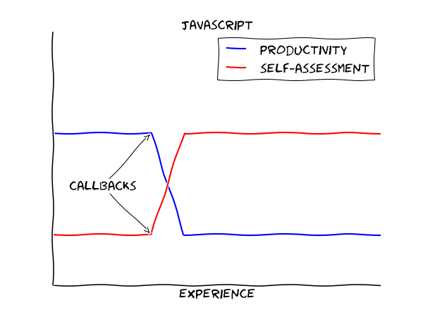

# 如何浅显的解释回调函数

> 2017/6/6 -> 2020/7/7
>
> 写作很简单，你把不该写的词都划去就行。—— 匿名

[heading-numbering]

## [no-toc] [no-number] TOC

[TOC]

> 本文献给 不知道什么是回调函数的人。😁

## 为什么要写这篇文章 TL;DR

- 正如诸多计算机科学教育者所说，回调函数，对初学编程的人来说，是一个巨大的坎。
- 目前面向初学者的回调函数的资料并不多。
- 学习的过程是：不知道 -> 知道 -> 能向别人解释清楚。



[align-center]

图片来源：[Dobiasd @ Github](https://github.com/Dobiasd/articles/blob/master/programming_language_learning_curves/javascript.png)

> 推荐的阅读顺序：[sec|什么是回调函数] 概念 -> [sec|生活中的回调函数] 举例 -> [sec|什么是回调函数] 概念 -> [sec|编程中的回调函数] 代码

## 什么是回调函数

[Wikipedia](https://en.wikipedia.org/wiki/Callback_%28computer_programming%29)：在计算机编程中，回调函数是

- **可执行代码** 作为 **参数** 传入 **其他的可执行代码**
- 并由 **其他的可执行代码** 执行这段 **可执行代码**

的过程。

具体过程（以函数为例）：

```
A() {
  // output P
}

B(fn) {
  fn();  // B knows only fn, not A
         // B treats fn as a variable
}

B(A);  // B called at T
       // B calling fn() (i.e. calling A())
```

- 函数 `A` 作为参数 `fn` 传入 函数 `B`
  - `B` 不知道 `A` 的存在，只知道 `fn`
  - `B` 将 `fn` 当作一个传入函数的局部变量处理
- 函数 `B` 通过 `fn()` 的语法，调用 函数 `A`
  - `B` 在 调用时刻 `T`，调用 `fn`
  - `B` 调用 `fn` 可能是是为了得到结果 `P`

对于没有接触过 [**函数式编程** _(functional programming)_](https://en.wikipedia.org/wiki/Functional_programming) 的初学者，这里有两个难以理解的地方：

- **函数** 竟然可以作为 **参数** 传递到另一个函数里
  - 函数是程序设计语言中的 [**一等公民** _(first-class function)_](https://en.wikipedia.org/wiki/First-class_function)（函数 `A`）
  - 将函数作为参数的函数，叫做 [**高阶函数** _(higher-order function)_](https://en.wikipedia.org/wiki/Higher-order_function)（函数 `B`）
- 通过参数 **传入的函数** `fn`，可以直接通过 `fn()` 的语法 **调用**

## 生活中的回调函数

### 场景一

- 有一个房间里没有灯，只有一个 **灯座**
- 你给 **灯座** 装上了一盏 **白炽灯**
- 到了晚上，你 **打开了灯座上的开关**
- 灯座通了电，点亮了 **灯座上的那盏灯**
- 于是，那盏 **白炽灯** 发出的 **温暖的光** 浸满了整个房间

这里对应了 [sec|什么是回调函数] 描述的五个要素：

- **白炽灯** 相当于是 函数 `A`
- **灯座** 相当于是 函数 `B`
- 对于灯座来说，**灯座上的那盏灯** 相当于是 参数 `fn`
- 对于灯座来说，**打开灯座上的开关** 相当于是 调用的时刻 `T`
- **温暖的光** 相当于是 回调结果 `P`

### 场景二

- 一天，你在房间里开了一个聚会，希望把灯光换成彩色的
- 于是，把灯座上的 **白炽灯** 换成了 **彩灯**
- 当你 **打开灯座上的开关时**，房间里充满了 **彩色的光**

场景二和场景一相比，
- 相同的要素是：**灯座**、**灯座上的那盏灯**、**打开灯座上的开关**
- 不同的要素是：**彩灯**、**彩色的光**

这里说明了回调函数的设计初衷 —— 利用 **依赖注入** _(dependency injection, DI)_ 实现 [**控制反转** _(Inversion of Control, IoC)_ 和 **依赖倒置** _(dependency inversion principle, DIP)_](Thinking-Scalability.md#控制反转-计算可扩展性)，即将控制权下发给回调函数：

- **灯座** 不需要知道灯座上的灯是 **白炽灯** 还是 **彩灯**
- **灯座** 只需要知道 **灯座上有一盏灯**
- **灯座** 在你 **打开灯座上的开关时**，会点亮 **灯座上有一盏灯**

这样就可以 **换上不同的灯泡，得到不同颜色的灯光**。

> DI is about wiring, IoC is about direction, and DIP is about shape. —— Brett L. Schuchert, from [_DIP in the Wild_](https://www.martinfowler.com/articles/dipInTheWild.html)

## 编程中的回调函数

### HTML + Javascript（在线演示）

我们平常用的最多的回调函数就是 `html/js` 上的 **页面事件**。例如，下面的例子就是一个如何在 **点击 `Click Me` 按钮时**，**弹出 `haha` 对话框** 的 `html/js` 代码。

``` html
<button onclick="alert('haha 😁 ~')">Click Me</button>
```

[align-center]

<p>
<button onclick="alert('haha 😁 ~')">Click Me</button>
</p>

这个例子中，我们也可以找到 [sec|什么是回调函数] 描述的五个要素：

- `alert('haha 😁 ~')` 相当于是 函数 `A`
- `button` 相当于是 ~~函数~~ `B`
- 对于 `button` 来说，`onclick` 相当于是 参数 `fn`
- 对于 `button` 来说，**点击 `Click Me` 按钮** 相当于是 调用时刻 `T`
- **弹出 `haha` 对话框** 相当于是 回调结果 `P`

### C（深入探讨）

实际上，不管是什么程序设计语言，回调函数都分为 **同步** 和 **异步** 两种。这里以 `C` 语言为例，分析两者的区别。

#### 同步回调

下面的代码展示了如何给一个数组从小到大排序的代码。代码调用了函数 `qsort` 进行排序，并通过指定 `compare` 为参数，实现元素大小的比较。

``` c
int compare (const void * a, const void * b) {
    return (*(int*) a - *(int*) b);
}

...

int values[] = { 20, 10, 50, 30, 60, 40 };
qsort (values, sizeof (values) / sizeof (int), sizeof(int), compare);
```

代码对应了 [sec|什么是回调函数] 描述的五个要素：

- `compare` 相当于是 函数 `A`
- `qsort` 相当于是 函数 `B`
- 对于 `qsort` 来说，`qsort` 的第四个参数 相当于是 参数 `fn`
- 对于 `qsort` 来说，排序过程中，**比较两个元素大小的时刻** 相当于是 调用时刻 T
- **`compare` 返回两个元素比较大小的结果** 相当于是 回调结果 `P`

由于调用 `compare` 的时刻 `T` 均是在 调用 `qsort` 结束之前（`qsort` 未返回），所以这样的回调被称为 **同步回调**。

#### 异步回调

下面的代码展示了如何在 Linux 下，阻止用户使用 `Ctrl C` 退出程序，并打印 `Press ^C` 提示。代码调用了函数 `signal` 进行回调函数的 **注册**（和同步回调不同，这里仅是注册）。

``` c
void block_interrupt (int code) { printf("\rPress ^C\n"); }

...

signal (SIGINT, block_interrupt);
```

代码对应了 [sec|什么是回调函数] 描述的五个要素：

- `block_interrupt` 相当于是 函数 `A`
- Linux 终端（`Ctrl C` 信号的发送者） 相当于是 ~~函数~~ `B`
- 调用 `signal` 函数注册 `SIGINT` 事件时的参数 相当于是 ~~参数~~ `fn`
- 对于 Linux 终端来说，**用户按下 `Ctrl C` 的时刻** 相当于是 调用时刻 `T`
- **`block_interrupt` 打印 `Press ^C` 提示** 相当于是 回调结果 `P`

由于调用 `block_interrupt` 的时刻 `T` 是 **用户按下 `Ctrl C` 的时刻**，均是在 调用 `signal` 结束之后（`signal` 已返回），所以这样的回调被称为 **异步回调**。

#### 同步和异步方式的不同

- 同步方式：
  - 通过 **参数**（例如 `qsort` 的最后一个参数）传递回调函数
  - 调用者 **立即调用** 回调函数（**调用时刻** 在函数返回前）
  - 此处的 `qsort` 和 `compare` **调用栈相同**
- 异步方式：
  - 通过 **注册**（例如 `signal` 函数）设置回调函数
  - 调用者 **先存储** 回调函数，在未来的某个 **调用时刻**，取出并调用 回调函数
  - 此处的 `signal` 和 `block_interrupt` **调用栈不同**

### 使用场景

- [CPS _(continuation-passing style)_](https://en.wikipedia.org/wiki/Continuation-passing_style)：函数通过参数传递 **调用结果的处理逻辑**（即 continuation），而不是 让函数 **直接返回调用结果**（例如 [异步、非阻塞 I/O 模型](../2019/IO-Models.md) 常用回调函数 处理 I/O 结果；以及上文提到的 `signal`）
- [**策略模式** _(strategy pattern)_](../2017/Design-Patterns-Notes-3.md#Strategy)：函数通过参数传递 **中间状态的处理策略**，而不是 让函数 **内部写死处理策略**（例如 上文提到的 `qsort`）

## [no-number] 写在最后

本文仅是我对回调函数的一些理解。如果有什么问题，望不吝赐教。😄

Delivered under MIT License &copy; 2017, BOT Man
