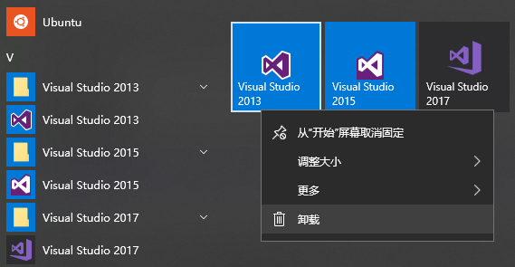

# 回调 vs 接口

> 2017/12/13
>
> There are just two kinds of languages: the ones everybody complains about and the ones nobody uses. —— Bjarne Stroustrup

[heading-numbering]

如果还不知道什么回调函数，可以阅读 [如何浅显的解释回调函数](Callback-Explained.md)。

## [no-toc] [no-number] TOC

[TOC]

## 一个故事

### 背景

前一段时间有一个类似的需求：

- 在 Windows 10 的开始菜单上新增右边的 **磁贴条目**（原来只有左边的 **列表条目**）
- 如果左边（或右边）的某个快捷方式被删除，右边（左边）展示的项目会对应消失
- 也就是，**同一套数据模型** 在 **多处展示**，某一处对数据模型的修改，需要 **同步** 到其他各处



为了实现这个功能，我们重构了相关的代码：

- 把原来的 **自治 view 模式** 转换成了 **MVC 模式**
  - 原来是 view 直接修改 model，并修改展示的内容
  - 现在是 view 通过 controller 修改 model，model 的更新通知 view 修改展示的内容
- 使用了 [观察者模式](Design-Patterns-Notes-3.md#observer)
  - 避免了 model 对 view 的直接依赖
  - model 只有一个，而未来可能有更多的 view 加入，不能耦合

### 方案

而这次对观察者模式的实践里，我遇到了一个问题：定义并继承 **`IObserver` 接口**，还是直接使用 **函数对象**，存储用于 _model 的更新通知 view 修改展示的内容_ 的回调执行的内容呢？

#### 采用接口

首先，定义 `IObserver` 和 `IObservable` 接口：

``` cpp
class IObserver {
public:
    virtual void OnNotified () = 0;
};

class IObservable {
public:
    virtual void Register (IObserver *observer) = 0;
    virtual void Unregister (IObserver *observer) = 0;
    virtual void NofityAll () = 0;
};
```

然后，改造 model，继承 `IObservable`，并实现注册、通知相关函数：

``` cpp
class Model : public IObservable {
public:
    void Register (IObserver *observer) override;
    void Unregister (IObserver *observer) override;
    void NofityAll () override;
};
```

下面分为两种实现方法：

**1. 继承 `IObserver`**

- 改造原有的 view，继承 `IObserver`，并实现接收到 model 通知的处理逻辑
- 注册到 model (`IObservable`) 上

``` cpp
class View : public IObserver {
    Model *_model;
public:
    View (Model *model) : _model (model) {
        _model->Register (this);
    }
    ~View () {
        _model->Unregister (this);
    }
    void OnNotified () override {
        // handle model update
    }
};
```

**2. 组合 `IObserver`**

- 针对每个 view 定义独立的继承 `IObserver` 的类
- 把这个类的对象，作为成员变量组合到 view 中

``` cpp
class ViewObserver;

class View {
    std::unique_ptr<ViewObserver> _observer;
public:
    // init/register/unregister _observer
};

class ViewObserver : public IObserver {
    View *_view;
public:
    ViewObserver (View *view)
        : _view (view) {}
    void OnNotified () override {
        // handle model update using _view
    }
};
```

#### 采用回调

- 定义 `ModelObserver` 为 `std::function`
- 为 model 加入 `IObservable` 相关的操作

``` cpp
using ModelObserver = std::function<void ()>;

class Model {
public:
    void Register (ModelObserver *observer);
    void Unregister (ModelObserver *observer);
    void NofityAll ();
};
```

- 给 model 注册一个 `std::function` 对象
- 在 `std::function` 对象内实现收到通知的处理逻辑
- 而这个例子中的 `std::function` 对象
  - 使用 `std::bind` 绑定成员函数得到
  - 将具体的处理逻辑委托到成员函数内

``` cpp
class View {
    std::unique_ptr<ModelObserver> _observer;
public:
    View () : _observer (new ModelObserver {
        std::bind (&View::OnNotified, this) }) {}
    // init/register/unregister _observer

    void OnNotified () {
        // handle model update using _view
    }
};
```

## 回调 vs 接口

我们讨论的这个问题很早以前就有人提出了：两种方式各有什么优缺点呢？

- 使用回调（`std::function` / `std::bind`）
- 使用接口（抽象类），传递派生类对象，调用这个对象的函数

[这个回答](https://stackoverflow.com/questions/22362691/pros-cons-of-a-callback-stdfunction-stdbind-vs-an-interface-abstract-cl/22366369#22366369) 讲的很好：

- 答主支持使用 `std::function` 的方式
- 使用 **接口** 的最大问题在于：需要定义 `IObservable` / `IObserver` 接口，并把原有的 类层次结构 _(class hierarchy)_ 耦合到新增的接口里 _(your type must be coupled to this hierarchy)_
- 而使用 **回调** 借助 `std::function`，可以装载 全局函数 _(global function)_、成员函数 _(member function)_、函数对象 _(function object, functor)_、匿名函数 _(anonymous function, lambda)_ 等，避免了各种破坏原有结构的接口

对于回调者，它关心的往往是一个 [**可调用** (callable)](http://en.cppreference.com/w/cpp/concept/Callable) 的东西，关注它的参数、返回值，而不关心调用的东西具体是什么。所以，

> 回调是 **面向可调用实体** 的回调，而不是 **面向接口** 的回调！

## 回调的实践

可调用的概念早在很多语言里都有实现。

### 脚本语言中的回调

例如，在 JavaScript 里，回调、闭包是一个最基本的概念。

在网页里，我们常常使用回调来处理用户的输入：

``` html
<button onclick="alert('haha 😁 ~')">Click Me</button>
```

[align-center]

<p>
<button onclick="alert('haha 😁 ~')">Click Me</button>
</p>

代码里的 `alert('haha 😁 ~')` 就是一个回调对象，注册到按钮的点击事件上。

### C++ 中的回调

然而对于不做类型检查的脚本语言来说，回调就是一个巨大的福利。而 **强类型、强检查** 的 C++ 语言，在 C++ 11 之前，只能使用 C 函数指针的方式实现回调。

为了让 C++ 的回调机制更易于使用，经过多年的思考，人们终于设计出了 **函数适配器** _(function adaptor)_。最基本的有两个：

- `std::bind` 通过绑定参数，实现参数的 [部分应用](https://en.wikipedia.org/wiki/Partial_application)，从而改变函数的签名
- `std::function` 装载 全局函数 _(global function)_、成员函数 _(member function)_、函数对象 _(function object, functor)_、匿名函数 _(anonymous function, lambda)_ 等可调用的东西；抹除装载对象的类型，只保留函数的签名

很多人会好奇：`std::function` 是怎么实现的？这里有一个 [简单的实现原理](https://shaharmike.com/cpp/naive-std-function/)。（[`std_function.cpp`](Inside-Cpp-Tuple/std_function.cpp)）

## 写在最后 [no-number]

~~由于最近太忙了，这篇文章准备了大半个月。~~

本文仅是我对回调和接口的一些理解。如果有什么问题，**欢迎交流**。😄

Delivered under MIT License &copy; 2017, BOT Man
