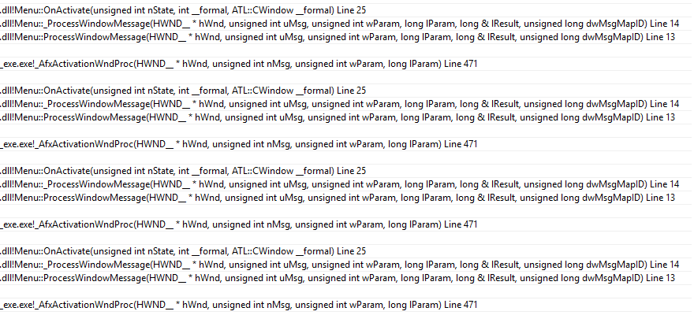
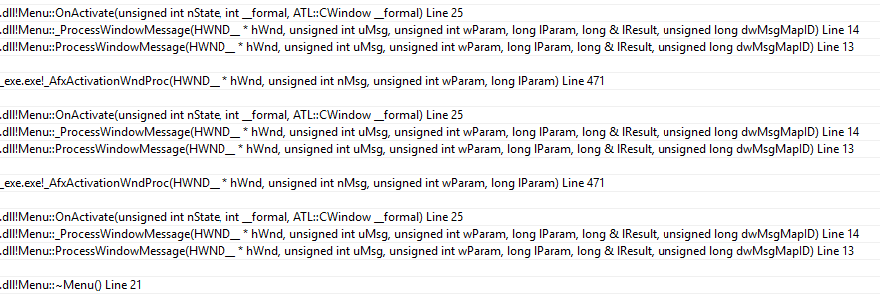

# C++ / Windows 的一个大坑

> 2017/12/22
>
> It ain't what you don't know that gets you into trouble. It's what you know for sure that just ain't so. —— Mark Twain

[heading-numbering]

## [no-toc] [no-number] TOC

[TOC]

## 铺垫 TL;DR

这次的故事 ~~（血泪教训）~~ **很有意思**，先从 **大家都熟知的** 一个 C++ 的和一个 Windows 的坑讲起。

如果你已经很熟悉这两个问题了，可以直接阅读 [sec|两件事结合在一起]。

### 不要在构造、析构时调用虚函数

> Item 9: Never call virtual functions during construction or destruction. —— Meyer Scott, _Effective C++ 3rd Edition_

对 C++ 的对象初始化/反初始化有基本了解的人，都知道：不要在构造函数（或析构函数）里调用虚函数 —— 因为对象的基类在构造（或析构）时，派生类内部的成员变量没有被初始化（或已经被反初始化），调用的虚函数会引起派生类访问不合法的成员变量，从而可能导致崩溃。

而编译器目前都允许构造、析构时，调用 **非纯虚函数**（基类构造、析构时访问的是基类对应的函数）。

一般的编译器都会对这个问题做检查。例如，下面的代码不能通过编译：

``` cpp
class Base {
public:
    Base () { virtual_setup (); }   // not compile: pure virtual call
    ~Base () { virtual_clear (); }  // not compile: pure virtual call
    virtual void virtual_setup () = 0;
    virtual void virtual_clear () = 0;
};
```

但是，事情往往没有那么简单：编译器只能检查构造函数、析构函数 **直接调用** 纯虚函数的情况，而不能检查到 **间接调用** 的情况（因为间接调用只能在链接时检查）。

例如，下面的代码初始化 `obj` 时，调用了 `Derived` 的默认构造函数，进一步调用了基类 `Base` 的默认构造函数；尽管构造函数里调用的 `setup` 不是虚函数，但它调用的 `virtual_setup` 却是一个纯虚函数，找不到实现，从而引发了崩溃。

``` cpp
class Base {
public:
    Base () { setup (); }
    void setup () { virtual_setup (); }
    virtual void virtual_setup () = 0;
};

class Derived : Base {
    void virtual_setup () override {}
};

Derived obj;  // crash!
```

下面的代码类似，`obj` 析构时调用了 `~Base`，而基类调用的 `virtual_clear` 是纯虚函数，也没有对应实现，也会引发崩溃。

``` cpp
class Base {
public:
    ~Base () { clear (); }
    void clear () { virtual_clear (); }
    virtual void virtual_clear () = 0;
};

class Derived : Base {
    void virtual_clear () override {}
};

{ Derived obj; }  // crash again!
```

在 MSVC 版本的 CRT _(C Runtime)_ 下，上面的崩溃会调用 [`_purecall`](https://docs.microsoft.com/zh-cn/cpp/c-runtime-library/reference/purecall)，从而引发 `R6025: pure virtual function call` 错误。而在 g++/clang++ 默认使用的 CRT 下，上面的崩溃会导致 `pure virtual method called`，从而引起 `core dump`。

### 删除用户对象前，必须销毁对应的系统对象

这也是一个原则性的问题：删除用户态对象之前，我们需要先销毁对应的系统对象，释放相关资源。

最常见的就是锁资源：如果持有一个锁 🔒，代码段退出前不释放，那么系统就永远不知道持有者是否可以释放资源，也永远不会回收相关资源（直到进程退出，系统自动回收资源）。这么一来，其他需要这个锁资源的地方在等待资源的释放，最后导致卡死。

除了互斥资源等内核对象外，常见的还有很多非内核对象，例如窗口、字体等。这些资源不释放虽然不会导致很严重的问题，但是会发生资源泄露。如果资源的数量是无限的（例如我们的机器有无限的内存、无限的存储空间），那么泄露也无所谓；但是在资源有限的情况下，我们需要考虑适时回收（释放）不在使用的资源。

为了方便编写代码，C++ 提出一个 [资源获取即初始化 _(Resource Acquisition Is Initialization, RAII)_](https://en.wikipedia.org/wiki/Resource_acquisition_is_initialization) 的设计思想。（最常见的是智能指针 [`unique_ptr`](http://en.cppreference.com/w/cpp/memory/unique_ptr) —— 让我们免受内存泄露和悬垂引用的危害）

## 两件事结合在一起

正如马克·吐温所说：让你陷入困境的不是你不知道的，而是你知道的认为不会坑你的东西。

代码很简单，完全看不出任何出现问题的迹象：

**1. 定义一个 `Menu` 基类**

``` cpp
class Menu : public CWindowImpl<Menu> {
    BEGIN_MSG_MAP (Menu)
        MESSAGE_HANDLER (WM_ACTIVATE, OnActivate)
    END_MSG_MAP ()

public:
    Menu (CRect rect) {
        Create (nullptr, rect, nullptr, WS_POPUP | WS_VISIBLE);
    }

    virtual ~Menu () {
        if (IsWindow ())
            DestroyWindow ();  // implicit call OnActivate!
    }

    LRESULT OnActivate (UINT, WPARAM wParam, LPARAM, BOOL &) {
        if (wParam == WA_INACTIVE)
            HideMenu ();  // leading to _purecall in CRT
        return 0;
    }

    virtual void HideMenu () = 0;
};
```

- 定义构造函数，申请资源
  - 根据 `rect` 创建一个特定位置、大小的窗口
- 定义虚析构函数，释放资源
  - 如果窗口资源没有释放，调用 `DestroyWindow` 销毁窗口
- 定义 `OnActivate` 函数，处理 `WM_ACTIVATE` 消息
  - 如果是窗口失去焦点，调用纯虚函数 `HideMenu`，让派生类处理

**2. 定义一个 `MyMenu` 派生类**

``` cpp
class MyMenu : public Menu {
public:
    MyMenu (CRect rect) : Menu (rect) {}
    void HideMenu () override { /* do something */ }
};
```

- 构造函数把 `rect` 传递给基类
- 重载 `HideMenu`，处理窗口失去焦点的逻辑

**3. 定义一个 `MyMenu` 对象**

``` cpp
// Client Code
{
    MyMenu menu (CRect { 0, 0, 100, 100 });
}  // crash!
```

非常诡异，在 `menu` 对象析构时，**有时候** 会发生崩溃！

> 在 Visual Studio 2013 下运行





而且崩溃时的栈非常奇怪：

- 整个栈很深，而且重复了一段有规律的调用
- 栈底是 `Menu` 的析构函数
- 栈顶是 `CrtDbgReport` 相关的代码

仔细观察，我们注意到了一个微妙的 CRT 调用：`_purecall`。经过分析，这个崩溃的原因是：

- 在 `menu` 对象析构时，如果窗口资源没有销毁，会调用 `DestroyWindow`
- **如果窗口还在显示**，`DestroyWindow` 会先让窗口失去焦点
  - 销毁窗口前需要处理 `WM_ACTIVATE` 消息
  - 同步调用 `BEGIN_MSG_MAP` 里的 `ProcessWindowMessage` 函数处理
  - 处理被转发到 `MESSAGE_HANDLER` 对应的 `OnActivate`
  - 而 `OnActivate` 函数又调用了纯虚函数 `HideMenu`
  - 在 Debug 下，纯虚函数被重定向到了 CRT 函数 `_purecall` 上，便于调试
- **如果窗口没有显示**，`DestroyWindow` 就不会隐式的调用 `OnActivate` 函数，也就不会发生崩溃了！

这个问题的出现非常让人难以察觉：没人会想到析构的时候会调用 `OnActivate` 函数！

甚至从直观上看，这段代码使用了 RAII 的风格处理了资源的申请和释放 —— 构造时创建窗口、析构时销毁窗口 —— 可以避免很多的资源泄露问题。

## 写在最后 [no-number]

很多时候，有人会说，如果我们使用了带有 **垃圾回收** _(garbage collection)_ 机制的语言，就不需要 **主动** 去做 **对象生命周期管理**，可以避免很多问题。

但就是这种时候，一旦程序员没能很好的理解 **垃圾回收机制如何自动管理对象的生命周期** —— 什么时候回收对象，回收时会释放哪些资源，资源释放会带来哪些副作用 —— 就可能遇到和这次崩溃类似的问题。

正如我的导师所说：从 `new` 每一个对象、申请一份资源起，我们就应该明确的知道它 **从何而来，去往何处**。

所以，如何做到呢？

> 先从原理上理解，再用工具做分析。

如果有什么问题，**欢迎交流**。😄

Delivered under MIT License &copy; 2017, BOT Man
