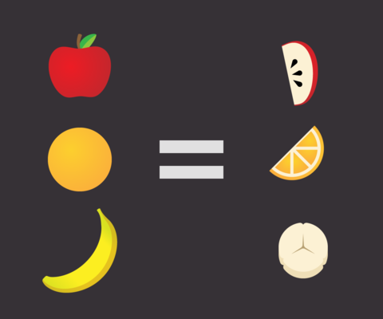
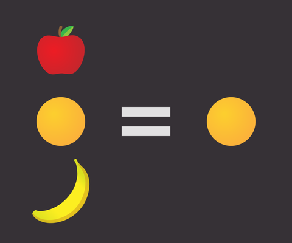

# 高阶函数：消除循环和临时变量

> 2018/10/27
>
> 如何设计使用高阶函数，让代码更简洁、更清晰。

## 目录 [no-toc]

[TOC]

## 使用 `every/some` (`all/any`) 合并谓词

> 数学描述：
>
> $$some/every: (E \rightarrow boolean) \times [E] \rightarrow boolean$$

很多时候，我们需要对多个元素检查同一个 **谓词** (predicate)。例如：

- 检查 **每个元素** 是否 **都** 满足一个条件；
- 检查是否 **存在某些元素** 满足一个条件。

设这组元素序列为 $S$，谓词为 $P$，用离散数学可以表述为：

- $\forall{x \in S} P(x)$
- $\exists{x \in S} P(x)$

### 例子：检查日期

输入的配置：

``` json
{
  "avaliable_days": [ 1, 3, 5, 7 ]
}
```

检查的目标：

- 检查一天是否为 周一、周三、周五、周日 中的某一天
- 注意：周日既可以表示为 `0`，也可以表示为 `7`

使用 `for` 实现的代码：

``` js
function isDayAvaliable(avaliable_days, day_now) {
  for (const day of avaliable_days) {
    if (day % 7 === day_now)
      return true;
  }
  return false;
}
```

使用高阶函数 `some` 化简的代码：

``` js
function isDayAvaliable(avaliable_days, day_now) {
  return avaliable_days.some(day => day % 7 === day_now);
}
```

## 使用 `map` 映射结果

> 数学描述：
>
> $$map: (E \rightarrow F) \times [E] \rightarrow [F]$$

图形描述：

[align-center]

[img=max-width:50%]



[align-center]

map - [source](https://atendesigngroup.com/sites/default/files/array-map.png)

### 例子：抓取页面

[cheerio.js](https://cheerio.js.org/) 提供了类似 jQuery 的解析 DOM 树接口，可以用于抓取页面元素。对于每个 DOM 节点的解析结果，都可以用两种方式获取：

- `.children()` 返回当前节点的子节点
- `.map(fn)` 遍历当前节点的子节点，执行函数 `fn`，返回执行结果并构造为数组

抓取的页面格式：

``` html
<div class="myclass">
  <p>section1</p>
  <ul>
    <li>Please visit <a href="about:blank">website1</a>!</li>
    <li>Please visit <a href="about:blank">website2</a>!</li>
  </ul>
  <p>section2</p>
  <ul>
    <li>Please visit <a href="about:blank">website3</a>!</li>
    <li>Please visit <a href="about:blank">website4</a>!</li>
  </ul>
</div>
```

抓取的目标结果：

``` json
[
  { "anchors": [ "website1", "website2" ] },
  { "anchors": [ "website3", "website4" ] }
]
```

使用 `for` 实现的代码：

``` js
const result = [];
for (cosnt e_ul of $('.myclass ul').children()) {
  const anchors = [];
  for (const e_a of $('li a', e_ul).children()) {
    const text = $(e_a).text();
    anchors.push(text);
  }
  result.push({ anchors });
}
```

使用 `map` 抓取的代码：

``` js
const result = $('.myclass ul').map(
  (i, e_ul) => { anchors: $('li a', e_ul).map(
    (i, e_a) => $(e_a).text()
  )}
);
```

### 例子：稳定排序

> 参考：[Fast stable sorting algorithm implementation in javascript (@stackoverflow)](https://stackoverflow.com/questions/1427608/fast-stable-sorting-algorithm-implementation-in-javascript/48660568#48660568)

``` js
// [ y1, y2, x, y3 ] => [ x, y1, y2, y3 ]
function stableSort(array, compare) {
  return array
    .map((item, index) => ({ item, index }))
    .sort((a, b) => compare(a.item, b.item) || a.index - b.index)
    .map(({ item }) => item);
}
```

## 使用 `filter` 过滤结果

> 数学描述：
>
> $$filter: (E \rightarrow boolean) \times [E] \rightarrow [E]$$

图形描述：

[align-center]

[img=max-width:50%]



[align-center]

filter - [source](https://atendesigngroup.com/sites/default/files/array-filter.png)

### 例子：数组去重：使用 `filter` 过滤出首次出现的元素

``` js
// [ x, y, y ] => [ x, y ]
function uniqueArray(array) {
  return array.filter((elem, i) => array.indexOf(elem) === i);
}
```

## 使用 `reduce` 规约结果

> 数学描述：
>
> $$reduce: (E \times F \rightarrow F) \times [E] \times F \rightarrow F$$

图形描述：

[align-center]

[img=max-width:50%]


[align-center]

reduce - [source](https://atendesigngroup.com/sites/default/files/array-reduce.png)

### 例子：数组扁平化：使用 `reduce` 规约拼接数组元素

``` js
// [ [x, y], [z] ] => [ x, y, z ]
function flatArray(array) {
  return array.reduce((acc, elem) => acc.concat(elem), []);
}
```

## 写在最后

> 延伸阅读：
>
> - [Simplify your JavaScript – Use .map(), .reduce(), and .filter()](https://medium.com/poka-techblog/simplify-your-javascript-use-map-reduce-and-filter-bd02c593cc2d)
> - [Array Map, Filter and Reduce in JS](https://atendesigngroup.com/blog/array-map-filter-and-reduce-js)
> - [js map, reduce, forEach, filter的一般实现](https://blog.csdn.net/u011700203/article/details/47191893)
> - [Reading 25: Map, Filter, Reduce | MIT 6.005](http://web.mit.edu/6.005/www/fa15/classes/25-map-filter-reduce/)
> - [Algorithms library - cppreference.com](https://en.cppreference.com/w/cpp/algorithm)
> - [Array - JavaScript | MDN](https://developer.mozilla.org/en-US/docs/Web/JavaScript/Reference/Global_Objects/Array)

相关代码：

- [js 版本](High-Order-Functions/High-Order-Functions.js)
- [C++ 版本](High-Order-Functions/High-Order-Functions.cpp)

如果有什么问题，**欢迎交流**。😄

Delivered under MIT License &copy; 2018, BOT Man
