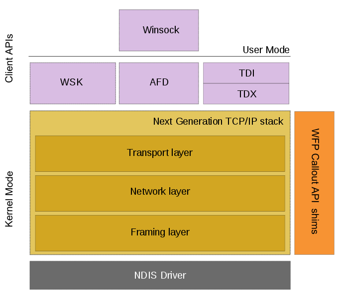
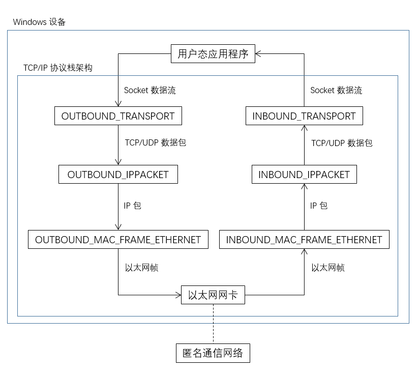

# 从 Windows Filtering Platform 学习 TCP/IP（2）

> 2018/5/1
>
> What you don't know can hurt you.

[heading-numbering]

实现代码：
https://github.com/BOT-Man-JL/WFP-Traffic-Redirection-Driver

## [no-toc] [no-number] TOC

[TOC]

## 背景

[上一篇文章](Learn-TCP-IP-from-WFP-1.md) 中，我们介绍了 如何使用 Windows Filtering Platform _(WFP)_ 的基本原理，并实现一个 [流量重定向的 PoC](Learn-TCP-IP-from-WFP-1.md#试验-流量重定向)（例如，用户用浏览器打开 Baidu，经过驱动修改后，可以变成 Google）。

在流量重定向的基础上，我们需要实现 [匿名通信客户端的功能](Learn-TCP-IP-from-WFP-1.md#背景)：

- 主机在将流量发往链路前，需要将流量进行伪造；将流量从链路收回后，需要将流量进行还原
- 链路上伪造的流量使用的 TCP/UDP 端口、IP 地址、以太网 MAC 地址，均为 **伪造地址**
- 两个通信的主机可以识别伪造的地址，并使用 **特定规则** 进行地址变换（例如，`81` 变成 `80`、`192.168.0.1` 变成 `192.168.0.2`）
- 从而使得链路上/主机上的黑客 **嗅探到** 的数据是经过变换后的 **伪造数据**
- 并对上层应用 **透明**，即上层应用不知道上述修改的存在

总结起来，匿名通信的 proof of concept _(PoC)_ 有以下几点：

- 修改 TCP/UDP **端口号**
- 修改 **远端主机 IP 地址**
  - 发送包的 目的 IP 地址
  - 接收包的 源 IP 地址
- 修改 **本机 IP 地址**
  - 发送包的 源 IP 地址
  - 接收包的 目的 IP 地址
- 修改以太网帧的 **源/目的 MAC 地址**

其中，前两点 [上一篇文章已实现](Learn-TCP-IP-from-WFP-1.md#试验-流量重定向)，本文主要讨论后两点 —— 修改 **主机 IP 地址** 和以太网帧的 **源/目的 MAC 地址**。

## 试验 —— 匿名通信

我们在同一个局域网内部署了两个主机，分别记作 `202` 和 `44`；并借助局域网内的另外两台主机进行试验，记作 `108` 和 `253`（主机并不真实存在，用作真实主机的匿名）。在主机 `202` 和 `44` 上进行如下测试：

- 主机 `202` 发往主机 `44` 的流量（包括 TCP/UDP/ICMP 协议）
  - 在主机 `202` **发出前**，**伪装** 为主机 `108` 访问主机 `253` 的流量进行传输
  - 在主机 `44` **收到后**，**还原** 为主机 `202` 访问主机 `44` 的原始流量
- 主机 `44` 发往主机 `202` 的流量，也进行类似的变换，从而实现完整的通信
- 在链路上/主机 `202` 和 `44` 上，黑客嗅探到的流量均为主机 `108` 和 `253` 通信的流量，即认为是两个匿名主机之间的通信

### 网络层修改发包

沿用了 [上一篇文章的架构](Learn-TCP-IP-from-WFP-1.md#网络层修改发包)，继续在网络层修改 **本机 IP 地址** —— `OUTBOUND_NETWORK` 层修改源 IP 地址，`INBOUND_NETWORK` 修改目的 IP 地址。

```
          socket              socket
            |                   ^
            |  TCP stream data  |
            ~                   |
       TCP Driver           TCP Driver
            |                   ^
            |     IP packet     |
            ~                   |
  :---- IP Driver ---------- IP Driver ---:
  |         |                   ^         |
  |         |     IP packet     |         |
  |         |                   |         |
  |  OUTBOUND_NETWORK     INBOUND_NETWORK |  <- modify here!
  |         |                   ^         |
  |         |     IP packet     |         |
  |         ~                   |         |
  :---- IP Driver ---------- IP Driver ---:
            |                   ^
            |   Ethernet frame  |
            ~                   |
```

#### 结果

- 修改后的 IP 包没能正确发出
- WinPcap 也抓不到任何流量

#### 分析

从原理上：

- 每个主机可能有多个 **网卡** _(network interface controller, NIC)_，每张网卡又可以 [分配多个 IP 地址](https://en.wikipedia.org/wiki/IP_aliasing)；但主机上的每个 IP 地址只会对应到一张网卡上
- 如果一个 IP 包要通过网卡发到以太网上，必须明确通过哪个网卡发送，进一步确定源 MAC 地址，才能构造出完整的 **以太网帧** _(ethernet frame)_
- 如果在确定源 MAC 地址前，修改了源 IP 地址，就不能查询到对应网卡的 MAC 地址了，于是 IP 驱动会丢弃这个包

```
         |
         |  (202 -> 44 / IP)
         ~
  OUTBOUND_NETWORK -> we update src/dst IP address here!
         |
         |  (108 -> 253 / IP)
         ~
     IP Driver -> search ARP table for host 253 (found)
         |        find MAC address of local IP 108 (not found)
         |
         |  (unreachable)
         ~
     MAC Driver
         |
         ~
```

所以，我们要在构造出完整的以太网帧之后，即在 **MAC 层**，修改发包的源 IP 地址。

### 网络层修改收包

经过修改，我们在 `OUTBOUND_MAC` 层修改源 IP 地址，`INBOUND_NETWORK` 修改目的 IP 地址。为了能让修改后的 IP 包送达目的主机（匿名通信协议通过 MAC 地址进行交换机路由，并配合 [sec|打开混杂模式] 网卡混杂模式实现端到端路由），我们在 `OUTBOUND_MAC` 层也修改了以太网帧的源/目的 MAC 地址。

```
          socket              socket
            |                   ^
            |  TCP stream data  |
            ~                   |
       TCP Driver           TCP Driver
            |                   ^
            |     IP packet     |
            ~                   |
  :---- IP Driver ---------- IP Driver ---:
  |         |                   ^         |
  |         |     IP packet     |         |
  |         |                   |         |            port &
  |  OUTBOUND_NETWORK     INBOUND_NETWORK |  <- modify remote IP &
  |         |                   ^         |            local IP (in)
  |         |     IP packet     |         |
  |         ~                   |         |
  :---- IP Driver ---------- IP Driver ---:
            |                   ^
            |   Ethernet frame  |
            ~                   |
  :---- MAC Driver -------- MAC Driver ---:
  |         |                   ^         |
  |         |   Ethernet frame  |         |
  |         |                   |         |
  |    OUTBOUND_MAC             |         |  <- modify MAC addr &
  |         |                   |         |            local IP (out)
  |         |   Ethernet frame  |         |
  |         ~                   |         |
  :---- MAC Driver -------- MAC Driver ---:
            |                   ^
            |   Ethernet frame  |
            ~                   |
```

#### 结果

- 主机 `202` 伪造的流量正确送达主机 `44`
- 两个主机上的 WinPcap 都能嗅探到伪造的流量
- 但是，主机 `44` 在 `INBOUND_NETWORK` 层并没有收到这个包

#### 分析

- 当 IP 包到达主机的 IP 驱动时，驱动会先检查目的 IP 地址，判断是不是送给自己的
  - 如果是，就发往上层驱动处理
  - 如果不是，就直接丢弃
- 从而提高上层驱动的处理效率（例如，TCP 报文里的 IP 地址错误，会导致找不到对应的 socket 五元组，也会被丢弃）

```
         ^
         |
    TCP Driver -> associate packet to socket
         ^
         |  (unreachable)
         |
  INBOUND_NETWORK -> we update src/dst IP address here!
         ^
         |  (unreachable)
         |
     IP Driver -> IP 253 is not local address, discard
         ^
         |  (108 -> 253 / IP)
         |
```

所以，我们要在 IP 驱动处理之前，即在 **MAC 层**，修改收包的目的 IP 地址。

### MAC 层修改发包/收包

最后，我们在 `OUTBOUND_MAC` 层修改源 IP 地址和源/目的 MAC 地址，`INBOUND_MAC` 修改目的 IP 地址。

```
          socket              socket
            |                   ^
            |  TCP stream data  |
            ~                   |
       TCP Driver           TCP Driver
            |                   ^
            |     IP packet     |
            ~                   |
  :---- IP Driver ---------- IP Driver ---:
  |         |                   ^         |
  |         |     IP packet     |         |
  |         |                   |         |
  |  OUTBOUND_NETWORK     INBOUND_NETWORK |  <- modify port &
  |         |                   ^         |            remote IP
  |         |     IP packet     |         |
  |         ~                   |         |
  :---- IP Driver ---------- IP Driver ---:
            |                   ^
            |   Ethernet frame  |
            ~                   |
  :---- MAC Driver -------- MAC Driver ---:
  |         |                   ^         |
  |         |   Ethernet frame  |         |
  |         |                   |         |
  |    OUTBOUND_MAC         INBOUND_MAC   |  <- modify local IP &
  |         |                   |         |            MAC addr
  |         |   Ethernet frame  |         |
  |         ~                   |         |
  :---- MAC Driver -------- MAC Driver ---:
            |                   ^
            |   Ethernet frame  |
            ~                   |
```

使用新架构，这个 PoC 成功完成了匿名通信。

> 实际上，可以将所有修改操作放到 `OUTBOUND_MAC`/`INBOUND_MAC` 层，去掉 `OUTBOUND_NETWORK`/`INBOUND_NETWORK` 层。但由于上述架构仅用于阐述原理，故不再演化。

## 关于网卡的一些坑

> 在实现匿名通信 PoC 的过程中，需要注意一些细节。

### 打开混杂模式

在 MAC 层，网卡在收包时也有类似 [sec|网络层修改收包] 中检查主机 IP 的处理机制：

在以太网帧送达主机时，网卡会检查帧头的目的 MAC 地址，判断这个数据帧是不是送给自己的（如果是就发往 CPU 处理，如果不是就直接丢弃），从而提高 CPU 的处理效率（网卡硬件检查的速度比 CPU 软件检查快）。

如果将网卡设置为 [混杂模式 _(Promiscuous Mode)_](https://en.wikipedia.org/wiki/Promiscuous_mode)，就可以不检查收包的目的 MAC 地址，直接把所有数据帧传给 CPU。这样，伪造了目的 MAC 地址的以太网帧，才可以正确的被上层驱动收到。

### 检查 Checksum Offload

由于 IP 包、TCP、UDP 报文中的 [checksum 计算](https://tools.ietf.org/html/rfc1071) 比较简单，而利用 CPU 计算这个字段比较浪费时间（例如，TCP 的 checksum 需要同时算上伪 IP 头、TCP 报头、TCP 报文）。所以，网卡提供了一个叫做 _Checksum Offload_ 的功能，利用硬件计算/校验 checksum，为 CPU 分担工作（硬件可以并行处理整个待校验数据段，而软件只能循序的读取并计算）。

然而，有的网卡并不支持 Checksum Offload，需要我们自己处理 checksum 的变换（IP/TCP/UDP 的 checksum）：

- 在发出网卡前，重新计算被修改的包的 checksum（可以在 `OUTBOUND_MAC` 层修改完后）
- 从网卡收回后，重新计算被修改的包的 checksum（需要在 `INBOUND_MAC` 层修改完后，重新计算 checksum；进入 IP 驱动时，会再次校验 checksum）

另外，为了快速计算修改后的 checksum，可以使用 [增量计算](https://tools.ietf.org/html/rfc1624) 的方法。

## 纵观 Windows TCP/IP 驱动架构

在 Windows Vista 版本后，微软公司看到了 TCP/IP 协议的潜力，重构了原有的网络架构，重新设计了下一代 TCP/IP 协议栈的新架构（如下图所示）。

[img=max-width:80%]

[align-center]



下一代 TCP/IP 协议栈架构以 TCP/IP 驱动 (`tcpip.sys`) 为核心：

- 对下：`tcpip.sys` 实现为一个 [NDIS 协议驱动 _(protocol driver)_](https://docs.microsoft.com/en-us/windows-hardware/drivers/network/ndis-protocol-drivers)，与下层的网卡 [NDIS 微端口驱动 _(miniport driver)_](https://docs.microsoft.com/en-us/windows-hardware/drivers/network/ndis-miniport-drivers) 传输数据，操作网卡收发数据包
- 对上：提供了内核 Winsock 接口 _(Winsock Kernel, WSK)_、Winsock（用户态库）+ 辅助功能驱动 _(Ancillary Function Driver, AFD)_（内核态驱动）和传输驱动接口 _(Transport Driver Interface, TDI)_
- 内部：封装了网络层、传输层的 IPv4/IPv6 协议、TCP/UDP 协议等相关实现
- 每层：加入 Windows 过滤平台 _(Windows Filtering Platform, WFP)_ 接口，增强 TCP/IP 协议栈实现的可扩展性，对外提供流量拦截、修改的能力

TCP/IP 驱动 (`tcpip.sys`) 从功能上可以划分为三层（如下图所示）：

- 传输层 _(Transport Layer)_：包括 `OUTBOUND_TRANSPORT`/`INBOUND_TRANSPORT`，主要实现将上层的 socket 数据流封装为 TCP/UDP 数据包（及还原）的功能
- 网络层 _(Network Layer)_：包括 `OUTBOUND_NETWORK`/`INBOUND_NETWORK`，主要实现将 TCP/UDP 数据包构造为 IP 数据包（及还原）的功能
- 成帧层 _(Framing Layer)_：包括 `OUTBOUND_MAC`/`INBOUND_MAC`，主要实现将 IP 数据包封装为以太网帧（及还原）的功能

[img=max-width:80%]

[align-center]



纵观 Windows TCP/IP 协议栈架构，最上层是为应用层提供稳定 TCP/UDP 传输功能的接口（Winsock/WSK/TDI），最下层是操纵网卡收发数据的网卡驱动（NDIS 微端口驱动），中间层是实现网络层、传输层核心功能的 TCP/IP 驱动（NDIS 协议驱动）。

数据传输的流程大致为：

- 发送数据：上层接口传入的 socket 数据流经过 TCP/IP 驱动，被构造为以太网帧发往网卡驱动，最后通过网卡发出
- 接收数据：从网卡接收的数据，被网卡组装为以太网帧后，通过 TCP/IP 驱动转化为 socket 数据流，最后传给上层接口

数据在传输的每个重要环节，都可以通过 WFP 驱动进行过滤和拦截，从而实现在不同位置上的流量修改。WFP 除了在上述三层外，还在多个流量传输的关键位置，提供一系列更丰富的 [过滤拦截点](https://docs.microsoft.com/en-us/windows-hardware/drivers/network/management-filtering-layer-identifiers)。由于本文不涉及，故不赘述。

设计一个在特定位置过滤/拦截/修改流量的方案，需要对 TCP/IP 协议有足够的了解。在设计 Windows 匿名通信客户端的过程中，我深入学习了 TCP/IP 协议实现原理。

如果有什么问题，**欢迎交流**。😄

> 延伸阅读：[匿名通信 Windows 客户端的设计与实现](Anonymous-Communication-Client-Design.md)

Delivered under MIT License &copy; 2018, BOT Man
