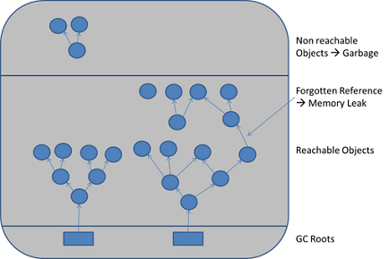

# 资源管理小记

> 2018/1/10 & 2018/11/14
>
> 主要讨论 面向对象程序设计中的资源管理，以及 跨系统边界资源管理的相关问题。

[heading-numbering]

> 2018/11/14 更新：
>
> - 对比 **命令式语言** 和 **面向对象语言**，在资源管理上的异同
> - 强调资源的 **申请/释放** 过程，与资源的 **使用** 在面向对象程序中的不同
> - 细化讨论 **强引用** 和 **弱引用** 的区别，以及在 C++ 里的具体实现
>
> [再谈资源管理（1）](Resource-Management-Explained-1.md)[（2）](Resource-Management-Explained-2.md)用一个具体的例子，进一步阐述本文的抽象讨论

## [no-toc] [no-number] TOC

[TOC]

## 为什么要做资源管理

**资源** _(resource)_ 是 _使用前需要被获取、使用后需要被释放_ 的东西。

- 从计算机的角度来看，常见的资源有：内存、锁、网络连接、文件等
- 从人类的角度来看，资源还可以是业务逻辑上的 **实体** _(entity)_ 在计算机中的表示

资源管理是程序设计中的一个重要问题：

- 资源是 **有限的**
  - 如果程序获取了资源后不释放，就会导致资源 **泄露** _(leak)_
  - 由于资源的有限性，其他程序就会申请不到这些资源
- 资源 **需要被释放**
  - 如果程序访问了已经被释放的资源，可能出现 **异常** _(exception)_
  - 如果程序没有做相应的检查，就会崩溃

## 资源和对象生命周期

> Item 13: Use objects to manage resources. —— Meyer Scott, _Effective C++ 3rd Edition_

一般的程序里，资源的 **生命周期** _(lifetime)_ 主要涉及三种操作：

| 资源生命周期 | 举例 C 标准库函数 |
|---|---|
| 获取资源 | [打开文件](https://en.cppreference.com/w/c/io/fopen) `fopen(filename, open_mode)` |
| 使用资源 | [读](https://en.cppreference.com/w/c/io/fread)/[写](https://en.cppreference.com/w/c/io/fwrite) 文件 `fread/fwrite(buffer, size, count, file)` |
| 释放资源 | [关闭文件](https://en.cppreference.com/w/c/io/fclose) `fclose(file)` |

在命令式语言中，对资源的操作往往通过函数调用的方式实现：

- 调用 open 函数获取资源，返回资源 **句柄** _(handle)_
- 以句柄作为参数，调用资源操作函数（例如 read/write）使用资源
- 使用结束后，以句柄作为参数，调用 close 函数释放资源

由于命令式语言没有对象的概念，资源的 **所有权** _(ownership)_ 往往并不明确，从而容易导致忘记释放资源：

``` c
// function A
  FILE* file = fopen(filename, "r");
  if (file) {
    // push |file| back to |pending_files|
    PushBack(pending_files, file);
  }

// function B
  // process all files in |pending_files|

  // ...

  // Oops: forgot to call |fclose| on |file|
  // (DestroyList will only destroy list nodes)
  DestroyList(pending_files);
```

在面向对象程序设计中，资源往往以对象为载体，资源对象 **拥有** _(own)_ 资源，通过对象的生命周期管理实现资源管理：

| 对象生命周期 | 举例 C++ 标准库 [`std::basic_fstream`](https://en.cppreference.com/w/cpp/io/basic_fstream) |
|---|---|
| 对象创建时，获取资源 | 构造 `fstream` 时根据 `filename/open_mode` 打开对应文件 |
| 通过访问对象，使用资源 | 调用 `fstream` 的 [`read`](https://en.cppreference.com/w/cpp/io/basic_istream/read)/[`write`](https://en.cppreference.com/w/cpp/io/basic_ostream/write) 函数读写文件 |
| 对象销毁时，释放资源 | 析构 `fstream` 关闭对应文件 |

### 资源对象的访问

在面向对象语言中，对资源的操作就被封装到了对象里 —— 对象成员方法的访问，会被 **映射** 为资源的使用。例如，调用 `file_object.read` 会映射为读取文件的操作，`file_object.write` 会映射为写入文件的操作。

需要注意的是，对资源对象的许多访问操作，与资源管理无关。例如，C++ 标准库中 [`std::basic_fstream`](https://en.cppreference.com/w/cpp/io/basic_fstream) 提供的读取文件接口 [`std::basic_istream::read`](https://en.cppreference.com/w/cpp/io/basic_istream/read) 并不属于 `fstream`，而属于其基类 `istream`。

在使用 `fstream.read(&value, size)` 的情况下，`fstream` 使用了文件资源；但在执行 `read` 时，不关心具体使用的是哪种来源读取 `value` —— 支持 `read` 操作的来源可能是 标准输入输出流（`iostream`）/ 字符串流（`stringstream`）/ 文件流（`fstream`）。

在面向对象语言中，由于 [**多态** _(Polymorphism)_](Object-Oriented-Programming.md#多态-Polymorphism) 概念的引入，把资源对象的 **访问和创建/销毁 分离** —— 使用一个资源对象，不需要知道它是特定的资源对象，还是其基类的其他子类。

### 资源对象的销毁

程序设计语言中，对象的销毁主要有两种方式：

- [手动销毁](https://en.wikipedia.org/wiki/Manual_memory_management) —— 需要在代码中显式销毁对象（包括使用 C++ 的 `unique_ptr`，本质上是程序本身主动销毁）
- 自动销毁 —— 一般通过运行时系统提供的 [垃圾回收](https://en.wikipedia.org/wiki/Garbage_collection_%28computer_science%29) 机制完成，不由程序主动销毁

以上两种方式，没有优劣之分；但对于资源对象的销毁，不同应用场景下各有利弊。例如：

- 手动销毁
  - **不释放不再使用** 的资源，会 **导致泄露** 问题（可以使用 [RAII 范式](https://en.wikipedia.org/wiki/Resource_acquisition_is_initialization) 避免）
  - 使用 **已经被释放** 的资源，会导致 **悬垂引用** 问题（可以通过观察者模式让引用失效，[sec|弱引用关系]）
  - 需要注意资源释放的时机，如果在资源 **正在使用时释放**（常见的是对象回调栈上，例如从  UI 的上下文菜单删除对象本身），可能导致 **崩溃** 问题（可以通过异步释放的方式改进）
- 自动销毁
  - （基于 [引用计数](https://en.wikipedia.org/wiki/Reference_counting#Variants_of_reference_counting) 的自动管理）对象之间 **循环引用**，会导致 **资源泄露** 问题（可以使用 [弱引用](https://en.wikipedia.org/wiki/Weak_reference) 解决）
  - （基于可达性的自动管理）对于不再使用的对象，忘记断开对它的引用，就会出现 **不可达引用**，导致 **资源泄露** 问题；例如把资源对象放入 cache 但不及时清理（只能需要程序员注意）
  - 资源的释放 **时机不可控**，往往依赖于垃圾回收系统的实现机制

[align-center]



[align-center]

图：被遗忘的引用 导致内存泄露（[来源](https://www.dynatrace.com/resources/ebooks/javabook/how-garbage-collection-works/)）

## 资源和对象的映射关系

> Item 14: Think carefully about copying behavior in resource-managing classes. —— Meyer Scott, _Effective C++ 3rd Edition_

用于资源管理的对象，往往需要注意它的 **复制语义**：

- 如果资源是不可复制的，那么这个对象也是不可复制的
- 如果资源可以复制，那么对象的复制会导致相应资源的复制
- 另外，有时候仅需要使用资源，而不关心资源的申请和释放

这里，就涉及到了资源和对象的 **映射关系**。

### 一对一关系

同一个资源，在系统中由一个 **可变** _(mutable)_ 对象来管理。

- 一般这个对象是 **不可复制** 的
- 这个对象创建时申请资源，销毁时释放资源
- 读取和修改这个可变对象，直接映射到对资源的读取和修改上

### 一对多关系

同一个资源，在系统中有多个 **可变** 或 **不变** _(immutable)_ 对象来表示。

- 一般涉及到 **多个对象共享资源** 的情况
- 在第一个对象创建时申请资源，所有对象都销毁时释放资源
- 读取任意一个对象，都直接映射到对资源的读取上
- 修改其中一个对象：
  - （可变对象，引用语义）不仅会修改资源，还会把修改自动同步到其他对象上
  - （不变对象，值语义）相当于只操作了资源的一个副本，不影响其他对象；需要手动把修改同步到其他对象上

> 关于 mutable/immutable 对象的讨论参考：
>
> - https://stackoverflow.com/questions/214714/mutable-vs-immutable-objects
> - https://stackoverflow.com/questions/8056130/immutable-vs-mutable-types

### 弱引用关系

有时候，我们仅需要使用一个资源对象，而不需要关心它的生命周期。例如，[sec|资源对象的访问] 使用通用接口读取数据，不需要关心资源申请和释放。

这类对象就是 [弱引用](https://en.wikipedia.org/wiki/Weak_reference)：

- 仅作为对 管理资源的强引用对象（一对一/一对多）的一个引用
- 不涉及资源的申请和释放
- 如果被引用对象还有效，读取和修改这个弱引用对象，和直接操作被引用对象一致
- 如果被引用对象无效，不能读取或修改这个弱引用对象

> 补充：
>
> C++ 可以通过将基类的析构函数设置为 `protected`，禁止资源对象通过基类指针析构。例如，observer 对象一般不希望通过 `IObserver*` 指针析构。（参考：[C.35: A base class destructor should be either public and virtual, or protected and nonvirtual](http://isocpp.github.io/CppCoreGuidelines/CppCoreGuidelines#c35-a-base-class-destructor-should-be-either-public-and-virtual-or-protected-and-nonvirtual)）
>
> ``` cpp
> class Interface {
>  public:
>   // ... (interface functions)
>  protected:
>   ~Interface() = default;
> };
> ```

### 在 C++ 的实现

| 实现方式 | 映射关系 | 可复制 | 修改同步 | 失效同步 |
|---------|----------|-------|---------|----------|
| `unique_ptr` | 一对一 强引用 | × | √ | - |
| `shared_ptr` | 一对多 强引用 | √ | √ | √ |
| 值对象       | 一对多 强引用 | √ | × | × |
| `weak_ptr`   | 弱引用       | √ | √ | √ |
| 普通指针     | 弱引用        | √ | √ | × |

> 关于 C++ 智能指针：[R.20: Use unique_ptr or shared_ptr to represent ownership](http://isocpp.github.io/CppCoreGuidelines/CppCoreGuidelines#Rr-owner)
>
> 虽然 C++ 标准库的 `weak_ptr` 不支持对 `unique_ptr` 的弱引用，但上述 `weak_ptr` 泛指能同步失效状态的弱引用。

## 超出系统边界的资源管理

> 由于没有这部分进行深入实践，只是简单提一下。

- 在一个系统内，一个资源往往可以利用 **一个实体**（业务上）表示，一个实体可以用 **一个或多个对象**（代码上）表示
- 而当一个资源被多个系统共享时，就会出现 **多个实体** 表示同一个资源（一个系统存在一个实体），资源对象的管理也变得复杂

### 中心化管理

- 在一个系统内，资源可以由一个（或多个）对象（协同）管理
- 而多个系统间，资源往往需要一个中心进行协调管理（master-slave 形式）

例如，一个操作系统下运行多个应用程序，每个应用程序是一个系统；操作系统作为中心，负责申请和释放资源；应用程序只是提交申请和释放的请求，操作系统响应这些请求。

### 使用资源标识

- 在一个系统内，一个资源对应一个实体；操作实体对应的对象，就实现了对资源的操作
- 而多个系统间，一个资源对应了多个实体；任意一个系统内，对实体（对象）的操作结果需要同步到其他系统里的实体（对象）上
  - 一般让不同系统的实体使用同一个唯一标识（ID, identifier）表示同一个资源（唯一性需要保证：如果一个资源被销毁，那么它曾经使用过的 ID 不能再分配给其他的资源）
  - 对资源的操作往往封装为 **事务** _(transaction)_，对所有操作进行 [事务处理](https://en.wikipedia.org/wiki/Transaction_processing)，保证数据的一致性

例如，不同设备上同步访问网页的历史记录，每条历史记录需要用一个唯一的 ID 表示；因为，用指针标识对象、用对象标识实体的方法，都不能跨越系统边界（类似于同一组对象/实体生存在多个平行的世界里）。

## 写在最后 [no-number]

之后会继续阅读 **系统设计** 相关的文献，不断完善这篇文章。😊

如果有什么问题，**欢迎交流**。😄

Delivered under MIT License &copy; 2018, BOT Man
