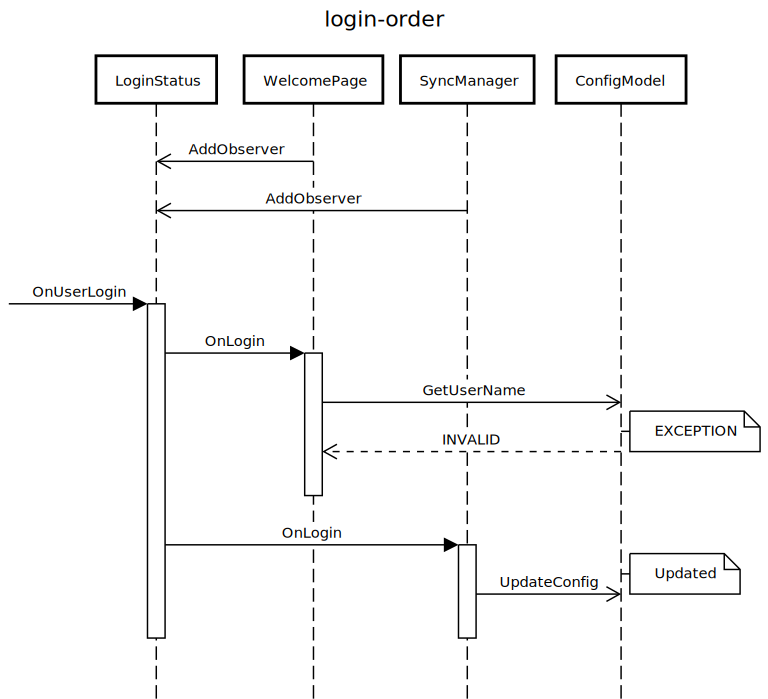

# 令人抓狂的观察者模式

> 2019/1/30
> 
> 本文总结了 C++ 实现观察者模式的一些问题，并给出基于 chromium 的解决方案。

读完这篇文章，带你绕过 C++ 观察者模式的那些坑。

## TOC [no-toc]

[TOC]

## 背景 TL;DR [no-toc]

[观察者模式](../2017/Design-Patterns-Notes-3.md#Observer) 是一个大家所熟知的设计模式。如果对观察者模式还不是很了解，可以先阅读 [理解观察者、中介者模式](../2017/Observer-Mediator-Explained.md)。

观察者模式主要用于解耦消息的发送者和接收者，能让代码更具有可扩展性。

> 用生活中的例子解释观察者模式 —— 有一家 **农场** 🚜 生产面粉，有多家 **面包房** 🏠 从他们那里购进面粉：
> 
> - 如果不采用观察者模式，农场只卖库存的面粉 —— 每次生产了新一批的面粉，就需要派人去各个面包房 **推销** 面粉（农场只能把面粉卖给推销员能到达的面包房）
> - 如果采用观察者模式，农场可以接收预定 —— 哪些面包房需要面粉，留下电话号码预定；等生产出新一批面粉，就从电话簿里逐个 **通知**（农场不需要关心最终把面粉卖给了哪些面包房，只需要卖出去就行）
> 
> 基于后一种模式：农场可以更快的开拓销路，甚至把面粉卖给更远的面包房；面包房可以引入更多的供应商，不仅仅从当地农场购买面粉。

定义面粉观察者 `FarmObserver`：

``` cpp
class FarmObserver {
 public:
  virtual void OnFlourReady() = 0;

 protected:
  virtual ~FarmObserver() = default;
};
```

定义农场 `Farm`：

``` cpp
class Farm {
 public:
  void AddObserver(FarmObserver* ob);
  void RemoveObserver(FarmObserver* ob);

 private:
  void NotifyFlourReady();
};
```

定义面包房 `Bakery`：

``` cpp
class Bakery : public FarmObserver {
 protected:
  void OnFlourReady() override;
};
```

假设有 1 个农场 和 2 个面包房：

``` cpp
Farm farm;
Bakery bakery1, bakery2;
```

面包房签订了农场的面粉购买合同，成为面粉观察者：

``` cpp
farm.AddObserver(&bakery1);
farm.AddObserver(&bakery2);
```

当麦子 🌾 成熟时，农场 🚜 开始生成面粉 📦，然后通知所有观察者 🕵️‍；面包房 🏠 买回面粉后，开始生成 面包 🍞、曲奇 🍪、蛋糕 🎂...

<!--
# https://sequencediagram.org/
-->

<!--
title farm-bakery
participant farm
participant bakery1
participant bakery2

bakery1->>farm: AddObserver
bakery2->>farm: AddObserver
space

[->farm: OnWheatReady
activate farm
note over farm: ProduceFlourFromWheat 🌾

farm->bakery1: OnFlourReady
activate bakery1
note over bakery1: ProduceBreadFromFlour 🍞
note over bakery1: ProduceCookieFromFlour 🍪
space
deactivate bakery1

farm->bakery2: OnFlourReady
activate bakery2
note over bakery2: ProduceCakeFromFlour 🎂
space
deactivate bakery2

deactivate farm
-->


> 理想很丰满，现实很骨感。

如果系统内大量使用观察者模式，可能会出现令人抓狂的问题。

## 生命周期问题

> 兄弟们，我先撤了。

### 问题：观察者先销毁

> 农场还在，面包房跑路了。

假设 bakery1 对象失效了，导致 `farm.NotifyFlourReady()` 调用的 `bakery1.OnFlourReady()` 会出现异常。

<!--
title invalid-bakery1
participant farm
participant bakery1
participant bakery2

bakery1->>farm: AddObserver
bakery2->>farm: AddObserver
destroyafter bakery1
space

[->farm: OnWheatReady
activate farm
note over farm: ProduceFlourFromWheat 🌾

farm->bakery1: OnFlourReady
note over farm,bakery1: FAILED

farm->bakery2: OnFlourReady
activate bakery2
note over bakery2: ProduceCakeFromFlour 🎂
space
deactivate bakery2

deactivate farm
-->


**解决办法**（约定俗成的）：

如果观察者不再继续观察，那么需要把它从被观察者的列表中移除：

``` cpp
farm.RemoveObserver(&bakery1);
```

<!--
title invalid-bakery1-solved
participant farm
participant bakery1
participant bakery2

bakery1->>farm: AddObserver
bakery2->>farm: AddObserver
space
bakery1->>farm: RemoveObserver
destroyafter bakery1
space

[->farm: OnWheatReady
activate farm
note over farm: ProduceFlourFromWheat 🌾

farm->bakery2: OnFlourReady
activate bakery2
note over bakery2: ProduceCakeFromFlour 🎂
space
deactivate bakery2

deactivate farm
-->


**更安全的方法**（参考 chromium）：

- 使用 [RAII _(resource acquisition is initialization)_](https://en.wikipedia.org/wiki/Resource_acquisition_is_initialization) 风格的资源管理，例如
  - 引入 [`ScopedObserver`](https://github.com/chromium/chromium/blob/master/base/scoped_observer.h)，在它析构时自动调用 `RemoveObserver`
  - 注意：在 `ScopedObserver` 析构调用 `RemoveObserver` 时，需要确保观察者和被观察者仍然有效
- 使用弱引用检查观察者的有效性，例如
  - [`base::ObserverList`](https://github.com/chromium/chromium/blob/master/base/observer_list.h) + [`base::CheckedObserver`](https://github.com/chromium/chromium/blob/master/base/observer_list_types.h) 在通知前检查观察者的有效性，避免因为通知无效观察者导致崩溃

### 问题：被观察者先销毁

> 面包房还在，农场跑路了。

由于 `Bakery` 在生命周期里，需要引用 `farm_` 对象（面包房从农场购买面粉），所以往往会把 `AddObserver/RemoveObserver` 放到 `Bakery` 的构造函数/析构函数里：

``` cpp
class Bakery : public FarmObserver {
 public:
  Bakery(Farm* farm) : farm_(farm) {
    if (farm_)
      farm_->AddObserver(this);
  }
  ~Bakery() {
    if (farm_)
      farm_->RemoveObserver(this);
  }

 private:
  Farm* farm_ = nullptr;
};
```

假设 farm_ 对象失效了，导致 `~Bakery()` 调用的 `RemoveObserver()` 可能出现异常。

<!--
title invalid-farm
participant farm
participant bakery1
participant bakery2

bakery1->>farm: AddObserver
bakery2->>farm: AddObserver
space

destroy farm
space

bakery1->>farm: RemoveObserver
note over farm,bakery1: FAILED
destroyafter bakery1

bakery2->>farm: RemoveObserver
note over farm,bakery2: FAILED
destroyafter bakery2
-->


**解决办法**（参考 chromium）：

- 引入外部协调者，完成注册/反注册操作，例如
  - 让 `farm` 和 `bakery1`/`bakery2` 的生命周期管理者，添加/移除观察关系（例如引入 [`ScopedObserver`](https://github.com/chromium/chromium/blob/master/base/scoped_observer.h)）
  - 而不是在 `Bakery` 的构造函数/析构函数里实现
- 被观察者销毁时，通知观察者反注册，例如
  - 在 `views::View` 析构时，通知观察者 [`views::ViewObserver::OnViewIsDeleting`](https://github.com/chromium/chromium/blob/master/ui/views/view_observer.h)
  - 注意：在回调时，不能直接从 `std::list`/`std::vector` 容器中移除观察者；而应该标记为“待移除”，然后等迭代结束后移除（参考 [`base::ObserverList::RemoveObserver`](https://github.com/chromium/chromium/blob/master/base/observer_list.h)）
- 用弱引用替换裸指针，移除时检查被观察者的有效性，例如
  - 使用 [`base::WeakPtr`](https://github.com/chromium/chromium/blob/master/base/memory/weak_ptr.h) 把 `Farm* farm_` 替换为 `base::WeakPtr<Farm> farm_`（比较灵活）

## 调用关系问题

> 这些细节之前没说清楚。

### 问题：死循环

> how old are you? —— 怎么老是你？

除了 [sec|问题：被观察者先销毁] 提到的

> 在回调时，不能直接从 `std::list`/`std::vector` 容器中移除观察者

类似于下边的代码：

``` cpp
for(auto it = c.begin(); it != c.end(); ++it)
  c.erase(it);  // crash in the next turn!
```

在回调时，还要避免隐式的同步触发当前回调；否则，一旦逻辑变得复杂，很容易进入死循环。

例如，对于登录用户修改配置后（例如联系人/云笔记），需要同步到服务器上（之后再同步到其他设备上）：

- 同步管理器 `SyncManager` 监听配置数据 `ConfigModel` 的变化，即 `class SyncManager : public ConfigObserver`
- 当 `ConfigModel` 更新后，通知观察者 `ConfigObserver::OnDataUpdated`
  - 同步管理器在处理 `SyncManager::OnDataUpdated` 时，可能先把 `ConfigModel` 的“最近一次同步时间”字段更新，再与服务器同步
- 由于 `ConfigModel` 更新，导致再次通知所有观察者 `ConfigObserver::OnDataUpdated`
  - 从而进入了死循环

<!--
title sync-last-update
participant ConfigModel
participant SyncManager

SyncManager->>ConfigModel: AddObserver
space

[->ConfigModel: OnConfigUpdated
activate ConfigModel

ConfigModel->SyncManager: OnDataUpdated
activate SyncManager
SyncManager->>ConfigModel :UpdateLastSyncTime

ConfigModel->SyncManager: OnDataUpdated
activate SyncManager
SyncManager->>ConfigModel :UpdateLastSyncTime

ConfigModel->SyncManager: OnDataUpdated
activate SyncManager
SyncManager->>ConfigModel :UpdateLastSyncTime

space
deactivate SyncManager

space
deactivate SyncManager

space
deactivate SyncManager

deactivate ConfigModel
-->


实际场景中，如果触发条件比较隐蔽时，问题就难以复现，例如

- 在处理 `SyncManager::OnDataUpdated` 时，调用 `ConfigValidator` 检查配置的合法性
  - 如果配置非法，`ConfigValidator` 先修正用户配置（例如，`2019/2/29` -> `2018/3/1`）
  - 可能导致配置更新，再次调用 `SyncManager::OnDataUpdated` 间接导致重入
- 假设测试用例没有覆盖“配置非法”的分支，配置就不会被修正，从而这个问题也不会被发现

<!--
title sync-validate
participant ConfigModel
participant SyncManager
participant ConfigValidator

SyncManager->>ConfigModel: AddObserver
space

[->ConfigModel: OnConfigUpdated
activate ConfigModel

ConfigModel->SyncManager: OnDataUpdated
activate SyncManager
SyncManager->>ConfigValidator :ValidateConfig

activate ConfigValidator
ConfigValidator->>ConfigModel: UpdateConfig
deactivate ConfigValidator

ConfigModel->SyncManager: OnDataUpdated
activate SyncManager
SyncManager->>ConfigValidator :ValidateConfig

activate ConfigValidator
ConfigValidator->>ConfigModel: UpdateConfig
deactivate ConfigValidator

space
deactivate SyncManager

space
deactivate SyncManager

deactivate ConfigModel
-->


**解决办法**：

方法很简单：

- （绕开）根据具体情况，打破循环的条件，例如
  - 在处理 `SyncManager::OnDataUpdated` 时，检查是哪些配置更新了
  - 如果只是“最近一次同步时间”字段的更新，就直接跳过合法性检查
- （根治）重构逻辑，避免出现这种情况，例如
  - 让 `ConfigModel` 直接通过 `ConfigValidator` 检查合法性、修正数据
  - `SyncManager` 收到 `OnDataUpdated` 拿到的就已是正确的数据了

### 问题：乱序回调

> 东西还没准备好就别来找我！

真实世界往往并不像农场和面包房那么简单 —— 观察者可能同时观察多个状态的变化，而这组状态变化的通知顺序往往是不确定的。在这种情况下，使用去中心化的观察者模式，会产生一些不确定的问题。

例如，用户登录成功后弹出欢迎界面提示，并在配置中允许用户选择“不弹出登录欢迎界面”：

[align-center]

<p>
<button onclick="if (!document.getElementById('no-login-prompt').checked) alert('欢迎界面')">登录</button>
<input id="no-login-prompt" type="checkbox"> 不弹出登录欢迎界面</input>
</p>

- 欢迎界面 `WelcomePage` 监听登录状态 `LoginStatus` 的变化，即 `class WelcomePage : public LoginObserver`
- 当 `LoginStatus` 登录/登出时，通知观察者 `LoginObserver::OnLogin/OnLogout`
  - 欢迎界面在处理 `WelcomePage::OnLogin` 时，检查配置数据 `ConfigModel`；如果没有选择“不弹出登录欢迎界面”，就弹出欢迎界面
- 登录状态发生变化时，同步管理器 `SyncManager` 会更新配置数据 `ConfigModel`
  - 登录时，从服务器上同步当前用户的配置
  - 登出时，将配置还原为本地配置

实际场景中，两个事件的触发时机和顺序是不明确的，例如

- 欢迎界面在配置更新前处理 `WelcomePage::OnLogin`
  - 用户配置和本地配置一致 —— 非常幸运，没出问题
  - 用户配置选择了“不弹出登录欢迎界面”，但本地配置没有选择 —— 弹出欢迎界面（用户崩溃了：明明已经选中了“不弹出登录欢迎界面”，怎么还弹出这个烦人的界面。。。）
  - 用户配置没选择“不弹出登录欢迎界面”，但本地配置选择了 —— 不弹出用户界面（同样不符合预期）
- 欢迎界面在配置更新后处理 `WelcomePage::OnLogin` —— 行为正确

<!--
title login-order
participant LoginStatus
participant WelcomePage
participant ConfigModel
participant SyncManager

WelcomePage->>LoginStatus: AddObserver
space

note left of LoginStatus: Bad Case
[->LoginStatus: OnUserLogin
activate LoginStatus

LoginStatus->WelcomePage: OnLogin
activate WelcomePage

WelcomePage->>ConfigModel: CanPrompt
parallel
WelcomePage<<--ConfigModel: yes
note right of ConfigModel: out of date
parallel off
WelcomePage->>]: ShowWelcome (BAD)

space
deactivate WelcomePage

LoginStatus->>SyncManager: SyncConfig
space

parallel
SyncManager->>ConfigModel: UpdateConfig
note left of ConfigModel: up to date
parallel off

space
deactivate LoginStatus
space

note left of LoginStatus: Good Case
[->LoginStatus: OnUserLogin
activate LoginStatus

LoginStatus->>SyncManager: SyncConfig
space

parallel
SyncManager->>ConfigModel: UpdateConfig
note left of ConfigModel: up to date
parallel off

LoginStatus->WelcomePage: OnLogin
activate WelcomePage

WelcomePage->>ConfigModel: CanPrompt
WelcomePage<<--ConfigModel: yes
WelcomePage->>]: ShowWelcome (OK)

space
deactivate WelcomePage
deactivate LoginStatus
-->



**解决办法**（参考 chromium）：

- 分别使用两个回调事件，表示 状态正在变化 和 状态变化完成，例如
  - 在 `views::Widget` 销毁时，通知观察者 [`views::WidgetObserver::OnWidgetDestroying`](https://github.com/chromium/chromium/blob/master/ui/views/widget/widget_observer.h)
  - 在 `views::Widget` 销毁后，通知观察者 [`views::WidgetObserver::OnWidgetDestroyed`](https://github.com/chromium/chromium/blob/master/ui/views/widget/widget_observer.h)
  - 用户登录相关的工作（同步配置）处理开始前、结束后，分别通知 `LoggingIn`/`LoggedIn`
- 将操作延迟到相关回调全部结束后执行，避免读取到变化的中间状态，例如
  - 在欢迎页面处理 `WelcomePage::OnLogin` 时调用 [`base::TaskRunner::PostTask`](https://github.com/chromium/chromium/blob/master/base/task_runner.h)，把实际的处理操作抛到队尾，延迟到当前任务结束后异步执行
  - 当操作被执行时，状态变化已经结束（已经不在同一个调用栈里），从而避免读取到不确定的变化中的状态
  - 类似于 JavaScript 里的 [`setTimeout(fn, 0)`](https://stackoverflow.com/questions/779379/why-is-settimeoutfn-0-sometimes-useful)
- 重构逻辑，使用中介者模式协调各个事件的回调顺序，参考 [理解观察者、中介者模式](../2017/Observer-Mediator-Explained.md)

## 写在最后 [no-toc]

本文仅是我在实际项目中遇到的一些问题，以及我的一些个人理解。如果有什么问题，**欢迎交流**。😄

Delivered under MIT License &copy; 2019, BOT Man
