# 公路车骑行独库公路

> 2024/9/29-10/4
> 
> 一路观四季，五里不同景，十里不同天。

独库公路（国道 217 中的一段，天山公路）曾被《中国国家地理》评选为 “纵贯天山脊梁的景观大道”，每年只开放 4 个月（6 到 10 月），浓缩了新疆的南北风景于一条路上。

[TOC]

## 攻略

[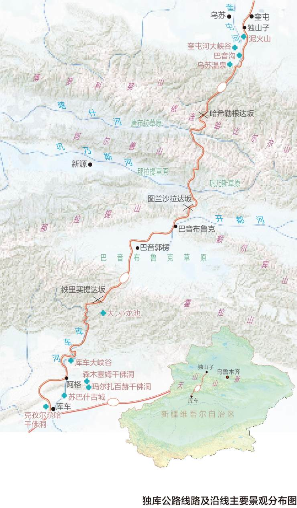](http://www.dili360.com/cng/article/p54698e3e0679b00.htm)

### 日程

- [独库公路骑行攻略丨最全6日版带爬升数据 - 小岛主vie](https://www.xiaohongshu.com/discovery/item/6678468e000000001c034e83?source=webshare&xhsshare=pc_web&xsec_token=AB2HWWicV8bsizkrk1lDls0vx4ZiUXOBWJUcK4ZwZu__8=&xsec_source=pc_share)
- [独库公路骑行最强最全攻略 - 517骑行驿站](https://mp.weixin.qq.com/s/OasbpXWEvGqw3b-DVc7VHQ)

注意：有一些比较久远的攻略（例如 57 好几年前写的）记录的里程不正确（例如 639 驿站标注的是在 630 位置），不建议使用。

### 装备

整体参考[《公路车骑行 318 川藏线》](../2023/318-Ride.md#装备)，做了以下补充：

- 推荐鞋套、防水手套，避免手脚淋湿导致失温；
- 推荐软一些的坐垫，避免坐骨酸痛（这次使用了更好的骑行裤+更软的坐垫，坐骨完全没有酸痛的困扰）；
- 避雷犀牛的尾包，很容易下垂蹭到车轮上（很多骑友都遇到了这个问题），因此本次骑行它只放了很少的行李；推荐洛克兄弟的尾包，有坚固的内衬支撑避免下垂。

### 在路上

- 独库公路整体偏向于旅游公路性质（相比于国道 318 的公路运输性质），沿途有很多停车休息区、观景台、商店、公厕（虽然很多都不开），路上有很多交警巡逻，大的岔路口都有交警值班，一般不让走 7 坐以上的车（除了那拉提附近修路、库如力到库车运煤），每天晚上禁止车辆进入（只进不出），安全性整体高于 318 这种普通国道。
- 沿途只有那拉提、巴音布鲁克是镇，而乌兰萨德克、乔尔玛、巴音郭楞乡、库如力都是乡村或者服务区，物资不如 318 沿途那么丰富，需要提前备好所有装备（新源县有个捷安特，途中有个骑友没有备胎了，老板免费送了他一条，只收了运费）。
- 新疆相对于北京会有 2 小时延迟（日出和日落都晚 2 小时），每天没必要起太早（早上 7 点天还没亮），也不需要担心到太晚导致天黑（晚上 8 点还有落日的余晖）；尽管一路上海拔不是很高，但着凉的情况下也容易高反、感冒，所以需要注意保暖；另外，还需要注意防晒和补水（即使是在北疆），否则会像我一样脸被晒伤、嘴唇被吹干开裂（个人感觉新疆比西藏干燥、南疆比北疆干燥）。
- 十一假期是独库公路的淡季，很多商户都关门下撤了，需要自己多带补给（实在不行可以求助路上自驾的人）；这个季节临近独库公路关闭的时间了，常会下雨、下雪导致临时封路（我们这几天几乎每个晚上都会下雪，但一大早就有人扫雪、除冰了，基本上到了 10 点左右又通车了）；不过建议多留出一天的缓冲时间，避免天气耽误行程（当然也可以花钱搭车，据说一程 300-400 左右）。
- 除了第一晚的乌兰萨德克、第五晚的库如力，剩下几天都可以住到不错的酒店或者民宿，所以建议在天气和体力允许的情况下跳过这两个地方。

## 日记

### Day0 北京-奎屯

去程（09/28）：MU8190（09:15 北京大兴 -> 经停鄂尔多斯 -> 14:55 吐鲁番交河）、Z69（16:02 吐鲁番北 -> 17:27 乌鲁木齐）、C823（18:35 乌鲁木齐 -> 20:38 奎屯）。

运输：在车店买了俩纸箱子，打包了两辆公路车（第一次自己动手，花了一个多小时）；需要从家里先转 3 趟地铁拿到机场托运，再转 2 趟火车；因为公路车只能走大件行李托运，而我们的航班是东航和中联航共享的航班，所以办理托运时跑了好几趟才找到地方，最后仓促的在贵宾厅拿了些三明治和水果当做今天的早午餐；还好我们买的是东航机票（超规行李 20kg 以内免费托运），否则如果买了中联航机票还得花几百块钱托运费（超规行李除了 20kg 限制外，还有三边长度小于 200cm 的限制）；由于在奎屯站叫不到货拉拉，我们便在车站门口花了大半个小时装车（一个好心的拉客司机大爷借给我们剪刀，不然又得剪半天扎带）；很幸运，飞机运输过程中虽然箱子被挤压凹陷、轻微破损，但车子都很完好。

住宿：一方面今天到的比较晚，另一方面奎屯吃的选择更多、住的也更便宜，所以之前就定在奎屯休息；住的是邦吉特酒店 110 一晚，环境很好，但洗澡水温偏低。

感受：虽然自己打包托运公路车能省几百块钱，但对于多次换乘的情况来说，实在是太折腾了（如果要正骑独库，建议邮寄到独山子；如果反骑，也可以考虑直飞托运到库车，不过还需要把车从机场拉到市区，不如直接邮寄方便）；第二天肱二头肌、肱三头肌都酸得不行，还好骑车不怎么用这俩肌肉。

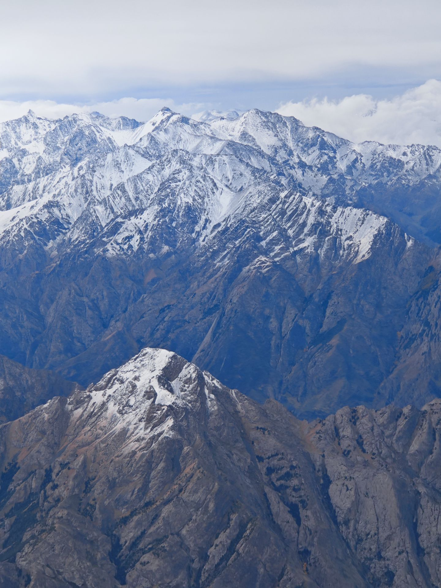

> 图：飞机上拍摄的天山

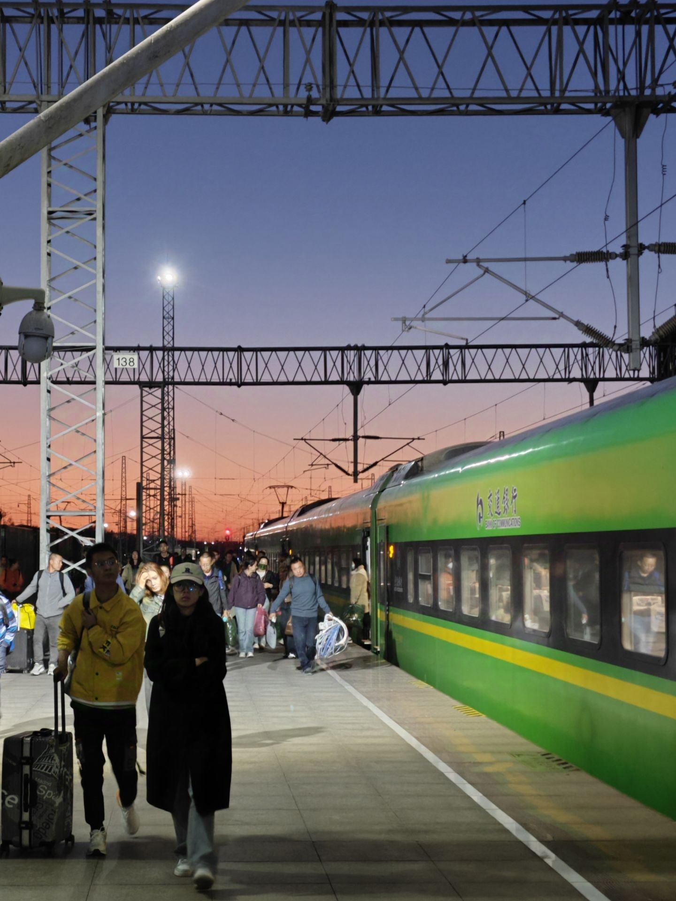

> 图：奎屯站的夕阳

### Day1 奎屯-独库公路起点（独山子）-乌兰萨德克（639 驿站）

天气：北疆深秋的晴天，太阳晒在身上加热的温度很快就会被冷风带走，放坡时更是令人瑟瑟发抖（她刚开始没穿保暖层，有点失温，后边吃了些月饼和肉串才缓过来）；到了河谷里有雾（能看到丁达尔效应），太阳落山后更加寒冷；山里没有光污染，能看到非常多的星星（我印象中见过星星最多的一次）。

路况：整体路况不错，不足的是边上经常有碎石，第二段爬坡的河谷里有好几段烂路（估计是常年落石导致的，不过不影响通行）；在路边停留时需要小心落石，尤其不要在山体侧停留（看到几只羊把石头踢下来，滑坡了一会）；全程无需车灯，只有一处防石走廊（棚洞）；每隔 1km 都有里程路牌，每隔 100 米地面上也都有百米里程计数，非常方便；进山前的路都比较宽，可以在白线外骑行，但进山后就只能在白线里骑了。

补给：进山前路上偶尔有民宿和饭馆，进了山里一路上有很多旅游休息区（商店+厕所+停车场），但到了最后的山谷里就没有太多补给点了；补给一般有馕，不过靠前的几家都卖完了（下午经过靠后的都还有卖，因为很多司机选择在靠前的休息区补给），于是我们买了 10 块钱 8 块的月饼；有的休息区还有烧烤，我们买了牛肉串 16 两串；路上有两个比较大的服务区，分别是进山前的乌苏驿、第一段放坡半路上的毛溜沟，看起来都有住宿的地方。

骑友：晚上在 639 驿站遇到 6 位骑友（只有 1 位骑自己的公路车，其余都是从 517 租的山地车），其中 1 位骑友第二天直接骑到那拉提，1 位骑友膝盖和脚踝受伤（估计是坐垫高度低+踩踏太用力）所以第三天直接搭车到库车，最终只有 4 位骑友和我们一起到达终点（两个男生、一对夫妻）；如果骑不动了，可以打电话给驿站老板（小杨）救援（据说没有额外收钱）。

感受：我们 10 点多吃完早餐从奎屯出发，中午 12 点才到达独山子起点，最后骑到了晚上 8 点半才到达 639 驿站；总爬升 2000，难度和骑 318 川藏线差不多（记错成爬升 1800，她骑到最后的平均 5% 的坡时很绝望）。

住宿：因为 639 小杨驿站正在翻修（据说全部改成标间），现在拆得只剩几间彩钢房，导致不能上厕所和洗澡（晚上可以自己找地方解决，但白天视野开阔就很不方便了），晚上 11 点半左右断电（说是发电机太吵影响睡觉）；老板晚上给房间烧上炉子，但半夜就灭了，早上起来很冷；厨房有一只猫咪爬到我的腿上，和我抢碗里的面条吃（后边我加了一份面，分了她几根，几乎都吃完了）；住宿 50 一个床位（因为住不满，我们俩人住三人间），凑合能住，但吃饭不便宜（一份盖浇面基本 30-40，早餐吃面自助 25 一人）。

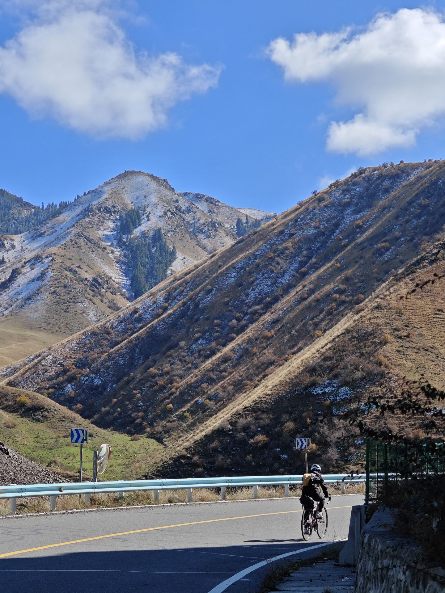

> 图：雪后长着植被的山谷

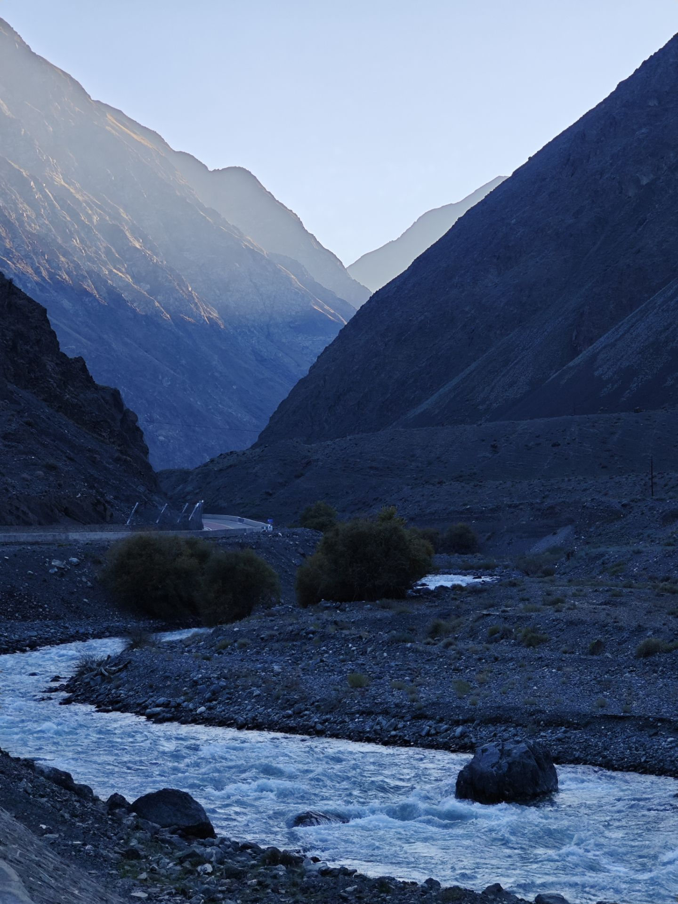

> 图：夕阳洒在奎屯河谷的山上

### Day2 乌兰萨德克（639 驿站）-哈希勒根达板-乔尔玛-唐布拉百里画廊

天气：又是一个晴天，但早晨 10 点半的河谷依旧十分寒冷（最低气温零下一度，但体感是北京零下 5-10 度的样子），一路上背阴处有很多冰挂（有的还会掉到地面上变成碎冰块）；到了中午 12 点半，山谷里才有阳光，直射的地方有些热，但背阴的地方又很冷，一路上忽冷忽热；出了河谷稍微暖和一些，爬雪山的过程不太冷，但靠垭口和放坡的时候又有些冷（放坡时手冷需要经常休息）；一路到了山脚下的乔尔玛已接近傍晚 7 点，由于太阳落山，去百里画廊的路上体感有些冷（尽管气温不太低）；总之我们一直都把所有衣服穿着，以应对忽冷忽热的天气。

路况：一大早独库公路没开，所以 11 点前路上几乎没有车，只有偶尔经过的几辆警车和道路管理车；从出发一直到垭口，常有地面不平（冻土路基融沉或者落石导致），偶尔也有炮弹坑，也有几处大落石（开通前看到一辆铲车在清理路上的塌方的碎石堆；放坡时我顺手清理了一处，因为看到好几辆车经过都刮到了底盘）；雪山垭口有个防雪长廊（棚洞）和一条短隧道（哈希勒根隧道），隧道里没有灯但路况还行，整体缓上比较安全；放坡到乔尔玛（路况和视野都很好，经常有大直道，但距离很长）和最后从乔尔玛到百里画廊（大家说是平路，实则起伏缓下），风景都很好（我们走走停停，路上观景和休息花了不少时间）。

补给：垭口前都有不少休息区（但厕所都不开，只能找地方解决，后边的厕所也是几乎都不开），放坡路上没看到任何补给（反爬的朋友需要在乔尔玛补给充足）；推荐碧玉湖旁边的一个新疆大哥的烤包子（皮薄馅厚，感觉比一般的烤包子肉都多一点点）只卖 15 一个，羊肉串 6 块钱，烤玉米 8 块钱，都比下边的休息区便宜。

感受：今天的主要难点在于爬雪山，一方面坡度不小（几乎是 5-6%，最大 16%），另一方面有些轻度高原反应（不仅是空气稀薄，还有冷热交替带来的不适），我们每爬几分钟就休息一会；路上的天瀑有些积雪和结冰，在阳光的照射下非常好看；百里画廊的风景很美，集合了雪山、树林、草原、溪流、牛羊马、毡房等诸多元素（虽说百里画廊的每一段都有不同的风景，但时间有限，我们只走了从乔尔玛路口往里 25km 的部分）。

住宿：由于昨天没有洗澡和上厕所，今天找了个环境好一些的酒店；住的是唐布拉野奢度假酒店 276 一晚，含自助早餐，环境很好，整个园区规模很大，房间里有热水、空调、WiFi；晚餐菜单看着价格不便宜，但分量不少，味道也不错（性价比远高于昨天山上的驿站）；乔尔玛也有宾馆，但据说条件不如百里画廊的酒店。

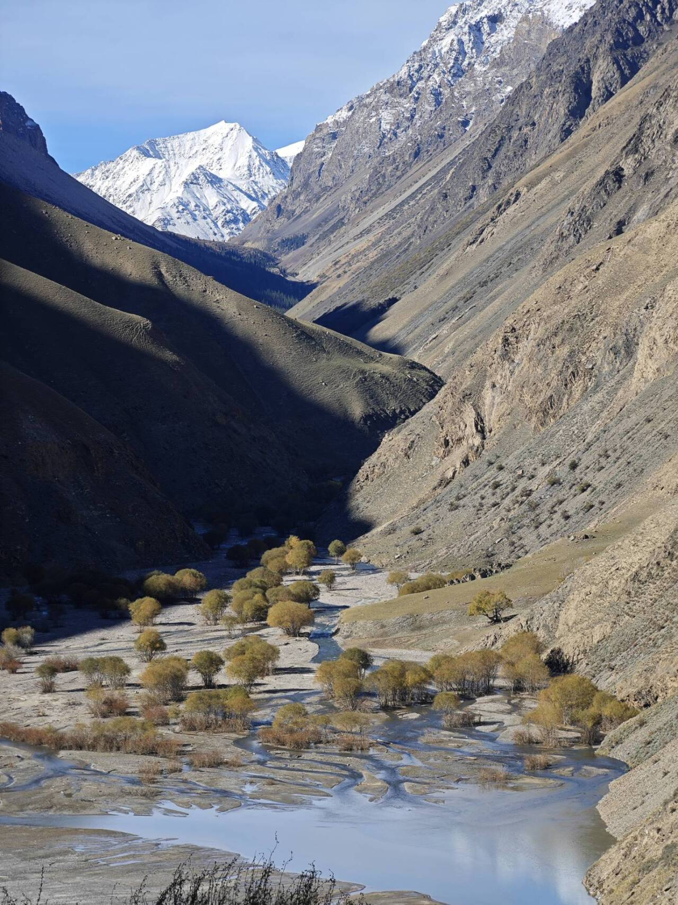

> 图：奎屯河谷里的小树林

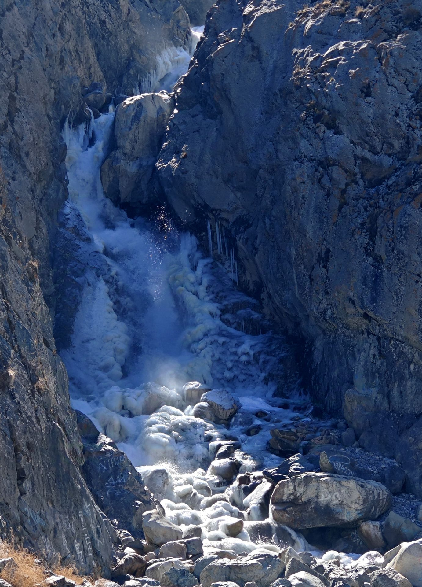

> 图：阳光洒在天瀑之上

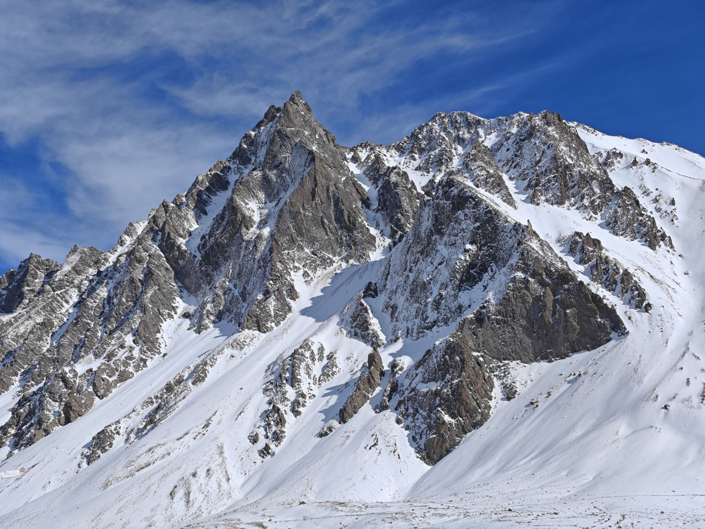

> 图：哈希勒根雪山

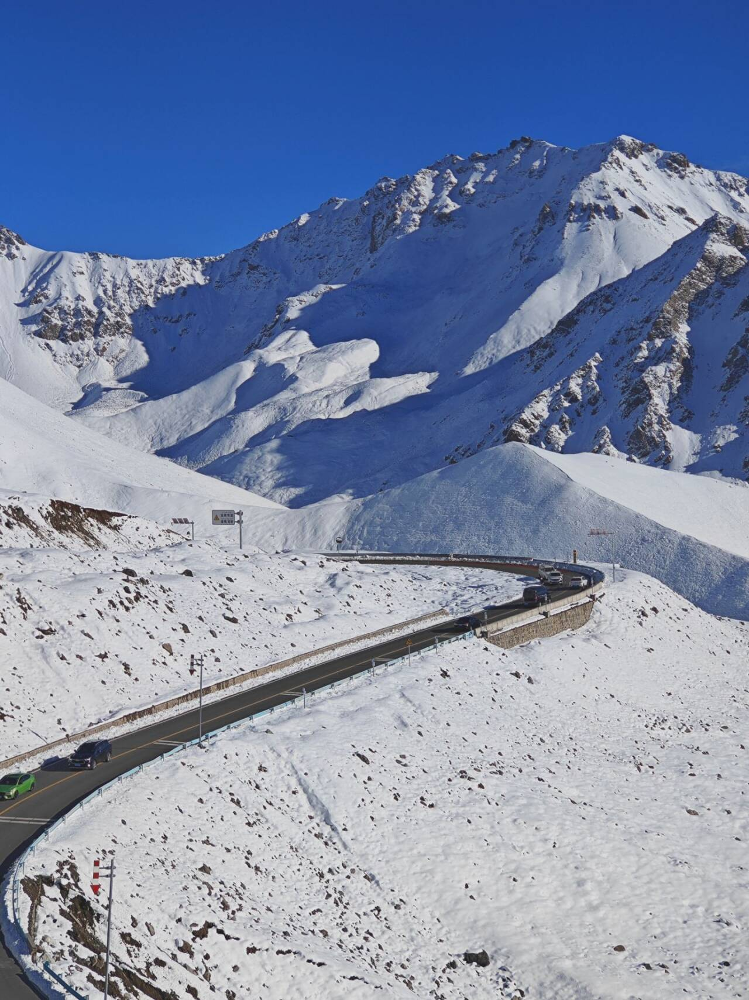

> 图：哈希勒根达板附近的雪山公路

### Day3 唐布拉百里画廊-乔尔玛-玉希莫勒盖达板-那拉提（哈萨克第一村）

天气：早晨在百里画廊往西走全程逆风，4% 的下坡踩两脚也到不了 30kph；虽然白天气温高于 10 度，但大风下体感依旧寒冷；爬坡路上温度还算舒适，但到了雪山垭口就开始刮冷风（我们没有拍照，快速换了装备就撤）；可能是因为下午 6 点才开始放坡，不管是山上还是谷底都冷飕飕的（手指经常冻僵麻木，最后吃了点馕才避免失温）。

路况：前半段起伏缓上都比较好骑，但接近垭口位置又是平均 5% 的陡坡；海拔较低的地方路面都比较完好，但高山上常有落石，路面也经常有破损（尤其在放坡时需要注意）；放坡结束后右转进那拉提景区的路都在修，一路上烂路+碎石+烟尘+大车，非常危险；垭口处是一条 2km 左右的隧道（玉希莫勒盖隧道），路面不平整，边上有砂石，边上的排水沟盖板经常破损（骑上去就翻车了），必须有灯，否则建议在旁边人行道推行。

补给：百里画廊到乔尔玛没有补给，乔尔玛爬坡路上的草地上有很多卖烧烤的，但拐弯上去爬雪山之后就没有补给了（只有已经关掉的蒙古包），放坡到了下边才有一两个休息区（但好像没看到卖吃的）；由于天气冷，路上有的烧烤摊不卖水，于是有个人美心善的小姐姐给了我两瓶水续命（不然要渴死了，后边她还停在半路递给我饮料，不过我没要），非常感谢！

感受：由于今天 10 点半才出发，导致后边比较赶，好在天黑前到达目的地，以后早点出发（傍晚没太阳照射会更冷）。

住宿：住在哈萨克第一村里的那时花开民宿，环境很好，超出预期，淡季只要 107 一晚；村里吃饭、补给都比较方便，不过和酒店合作的满口香餐厅性价比一般（实物和照片差距较大，椒麻鸡也几乎都是碎骨头），于是第二天我在旁边的另一家餐厅吃了早餐（羊肉包子 3 块钱一个，我吃了 5 个）。

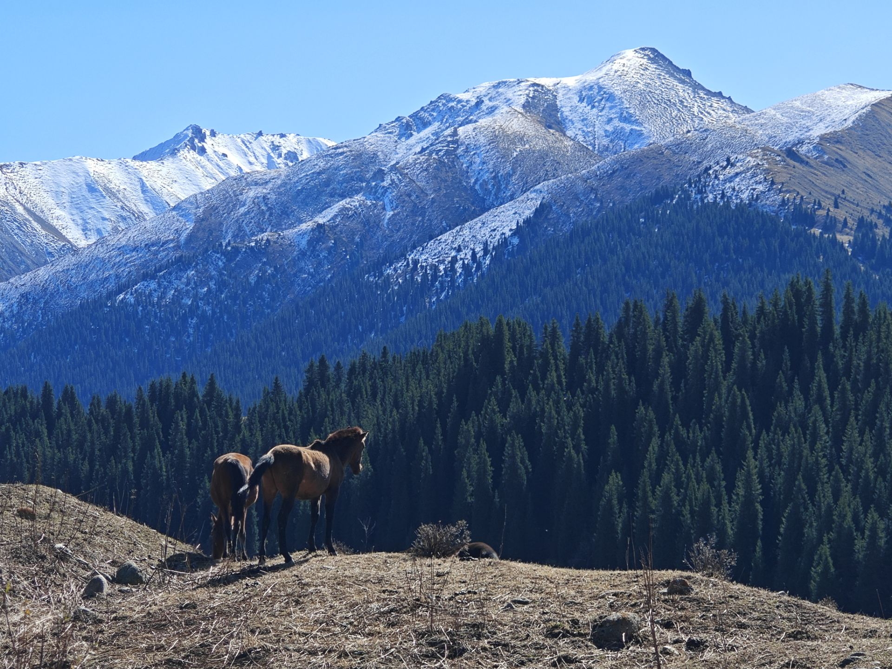

> 图：唐布拉百里画廊上的马

> 图：唐布拉百里画廊上宝石般的蓝色溪流

> 图：远眺巩乃斯-那拉提森林

### Day4 那拉提（哈萨克第一村）-拉尔墩达板-巴音布鲁克

天气：除了早晚气温稍微有点冷，今天整体都比昨天暖和（早穿棉袄午穿纱），而且路上全程都没有雪；阳光下体感会热一些，容易出汗，但一到阴面，冷风一刮，又会感觉很冷（还是得穿足衣服）。

路况：大部分路面都还行，但从那拉提出来到 G217 和从拉尔墩达板到巴音布鲁克的两段路面都很不平整，骑公路车手会麻；今天全程没有隧道，只有一条防雪走廊（棚洞），无需车灯；从拉尔墩达板到巴音布鲁克的草原没有遮挡，可能会有横风，下坡时需要注意安全（多次感觉到后轮打滑）。

补给：从那拉提到垭口路上的小贩都是卖蜂蜜的（很有意思的是，有的商家会自己制作一个“观景台”的大牌子，吸引游客在他那停留），偶尔有几家可以烧烤或者饭店，补给明显比前几天少，需要提前备好补给。

感受：今天坡度整体比前几天缓一些，适合恢复、修整；很巧，晚上在巴音布鲁克的酒店里看“巴音布鲁克拉力赛”（CCTV-6 在播 “飞驰人生 2”）。

住宿：本想今天直接到巴音郭楞乡，但听说吃住都不太行，于是住在镇上的福瑞酒店（据说是四星级），环境很好；由于酒店是新开的，房间气味很大（开了窗好一些，好在晚上不吵），即使是十一假期（应该是淡季）也只要 215 一晚，含自助早餐，有免费的自助洗衣机。

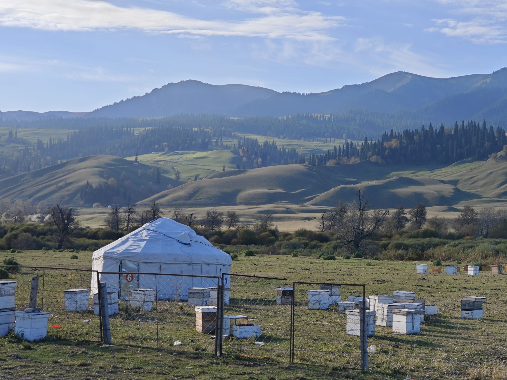

> 图：那拉提河谷草原上的养蜂毡房

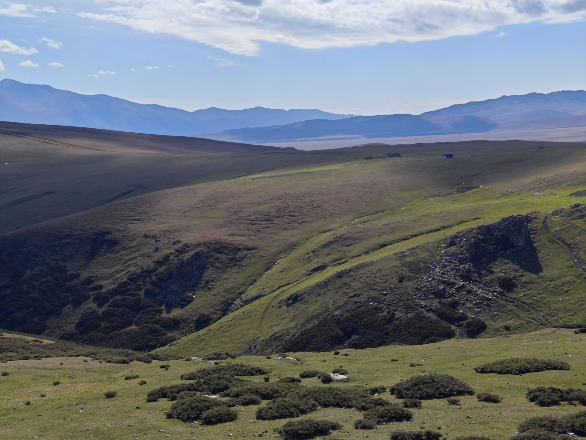

> 图：巴音布鲁克草原

### Day5 巴音布鲁克-巴音郭楞乡-铁力买提达板-库如力

天气：早上出门时还有太阳，但才到中午就有一大片一大片的云从西边飘来；刚爬坡时先是下小雨，再是中雨，然后是小雪和小冰雹，靠近垭口时变成大雪；放坡时反过来，山上大雪纷飞，下去后逐渐变成冰雹和中雨；由于冰雨让我们差点失温（尽管戴了洗完手套，每放坡一段手指很快就没知觉了，需要休息甩手才能回血；到了龙池附近的胡杨林时我们都有些打颤，吃馕也很难恢复），于是决定在龙池修整，饭后雨渐停；山里水汽重、气温低（尤其是龙池附近的迎风坡），下山后发现气温比山上越来越高（晚上到达库如力都还有 8-9 度）。

路况：进山前的草原平路都非常笔直，很多司机会在此超速行驶（镇子附近的草地上看到好几只流浪狗，再往前还有一只被撞死的）；巴音布鲁克附近和山里的路有很多烂路和颠簸路，尤其是放坡的时候需要慢点看清楚路再走；由于下雨地滑，再叠加路烂的难题，每次在 5-8% 的下坡都刹不住（好在路宽车少，有空间容错）；从干吉尔（山口大桥）到大龙池的路上，联通手机都没信号，想叫救援都没机会；路上有 3 条隧道，第一条呼屯郭愣隧道 640 米、无灯、路面较平、整体缓上，第二条铁力买提隧道 1895 米、有灯且够亮、前半段平路路面较平、后半段缓下路面不平整，第三段卡尔脑隧道大概 1 公里、无灯、路面很平、整体缓下；这次在独库上遇到的大部分司机都很文明，只有今天才遇到两个朝你冲过来、贴着你逆行超车的垃圾（希望它们和不规矩的车能一起早日长眠于山谷里；不过不遇到垃圾只能说明骑的时间不够长，不要影响心情）。

补给：进山前只有巴音郭楞乡、888 骑行驿站、干吉尔（山口大桥/天鹅湖）几个地方有商店和餐馆，进山后没有补给，下山到了大龙池才有餐馆和住宿；一路上厕所也很少而且几乎都不开门，好在桥洞比较多；我们在大龙池选了最近的第二家“依明江美食馆”，老板家的小朋友看到我们很冷，于是毫不犹豫的把我们带进自家的里屋里烤火，还给我们搬了两把椅子放在炉子旁（刚开始衣服太湿，没好意思坐）；我们点菜后，也是围在里屋的炉子旁吃的；他们家的饭菜价格比之前的很多家都实惠，味道也不错，值得推荐；吃饱后身体终于回温，我们才继续赶路（住大龙池会很冷，而且贵不少）。

骑友：放坡路上遇到一位骑友，由于装备不足（没有手套和鞋子的防雨措施），在半山腰上失温，最终只能打电话找 988 驿站上山救援（据说收费 200 一次，比起山上很多商户要价不算贵）。

感受：我们前一晚以为只是阴天不会下雨，没有把防雨装备拿到外边，导致半路上多花了半小时整理（本次行程带上的所有装备到今天都用上了，没有一件是白带的）；虽然山上下了暴雪，但幸运的是我们下山时还没有封路（据说再晚一些就积雪结冰了），还算比较安全；在大龙池修整了近一小时，夜骑了一个多小时（还好前一晚提前把电筒充满，不然半路没电了也得呼叫救援），终于到达库如力；不过看到了龙池旁的粉红雪山和油画般的龙池瀑布，累一点也值了。

住宿：库如力住宿条件都不太行，但比大龙池便宜不少（好像只有一家酒店，400-500 一晚）；我们住了溪山石园客栈 200 一晚（前台说给我们比网上 229 更低的价格），招待所水平，凑合能住，有热水洗澡，但卫生条件不确定（进门就看到洗手台上有只蚰蜒）；刚进村有一家和 517 合作的 988 骑行驿站（渝荣民宿客栈），据说环境也还行，也有独卫洗澡；库如力比较小，住宿都在独库公路边上，晚上刚睡和早上准备起床的时候会有大车经过，不过半夜睡觉的时候都很安静（独库公路每天晚上都只进不出）。

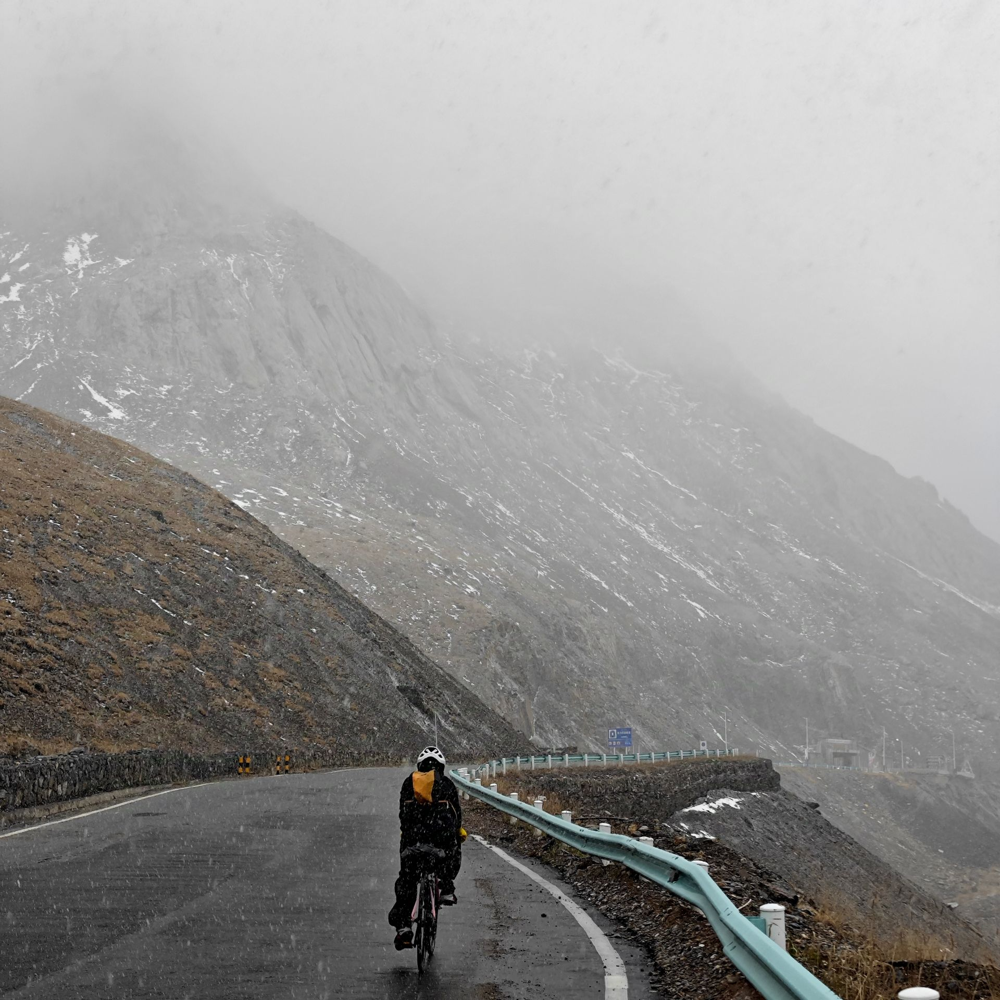

> 图：暴风雪中的铁力买提达板

> 图：粉色夕阳洒在大龙池的雪山上

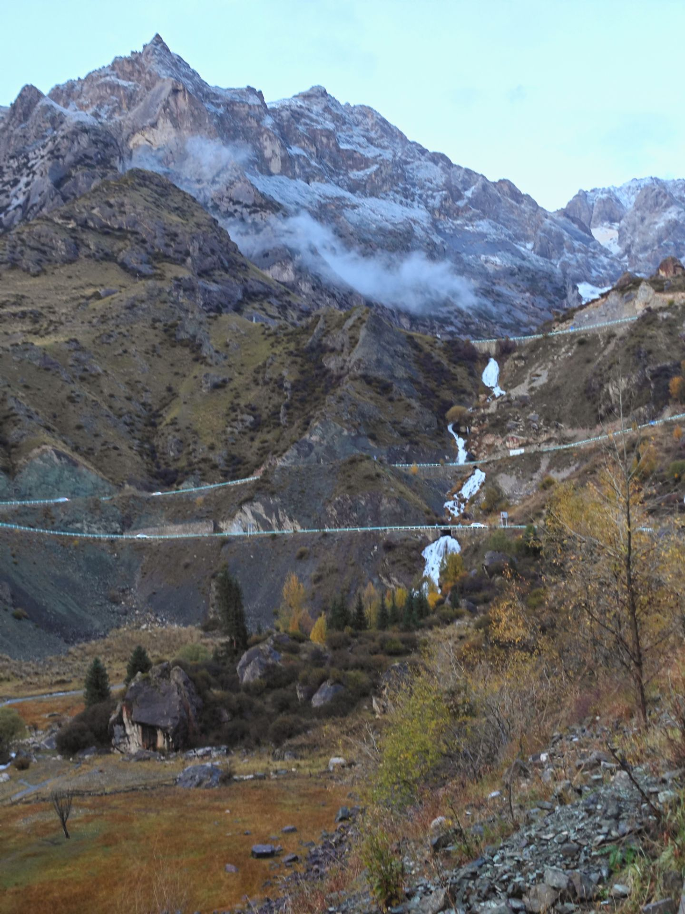

> 图：从雪山奔流而下的龙池瀑布

### Day6 库如力-独库公路终点-库车

天气：雨后晴空万里，今天是气温最高的一天（感觉南疆整体比北疆热不少，北疆晴天还得注意保暖，南疆晴天则需要注意补水和防晒），运动强度太高就会出很多汗。

路况：起伏+下坡+缓下，需要爬一些坡，下坡坡度也有较陡的路段；好路烂路各占一半，虽然今天的路比较宽，可以在白线外骑行，但白线外有很多容易扎胎的碎石、木屑、铁丝、塑料、纸壳（尤其是最后快到库车的那段），尤其是下坡时，左边车流呼啸，右边路况堪忧，再加上随机出现的横风，十分危险（所以很多人走白线外都扎胎了）；路上大车很多，不过很多司机都会鸣笛提示或者离你远一些再超车；在大车经过时需要注意侧风，握好车把对抗扰流；今天有一条没有灯的短隧道（盐水沟隧道），全程缓下，中间路况还行，但边上不太干净（建议先看看后边有没有车，确认远处都无车后靠左一点快速通过；我们经过时后边来了一辆大车，司机很有耐心的一直刹车等我们出去了才超车）。

补给：路上的一些村子或者路口都有餐厅，天山神秘大峡谷也可以吃饭（自行车可以停在门口小卖部，再走进去游览景区，需要 1-2 小时往返）；天气干热的情况下，建议多备水。

骑友：从天山神秘大峡谷到库车的路上，遇到一个骑山地车的库车本地骑友在给车胎打气，说是扎胎了没有工具修理，打算打一段走一段，于是我停下来花了半小时帮他补胎（路上风声太大，找孔就花了十分钟），最后他给了我一瓶水（水勉强够，所以没要）。

住宿：住的是金色阳光酒店（长宁路）184 一晚，含早晚自助餐、免费洗衣 4 件，环境很好，房间面积很大；不足是距离市区有点远，周围几乎没什么好吃的；早晚自助餐人都多，菜品种类和份量都不太多，味道尚可，但建议在外边吃更好的。

感受：今天和昨天是最危险的两段，建议降低对独库公路路况的预期，做好面对危险的准备。

> 图：阳光下通红的天山神秘大峡谷

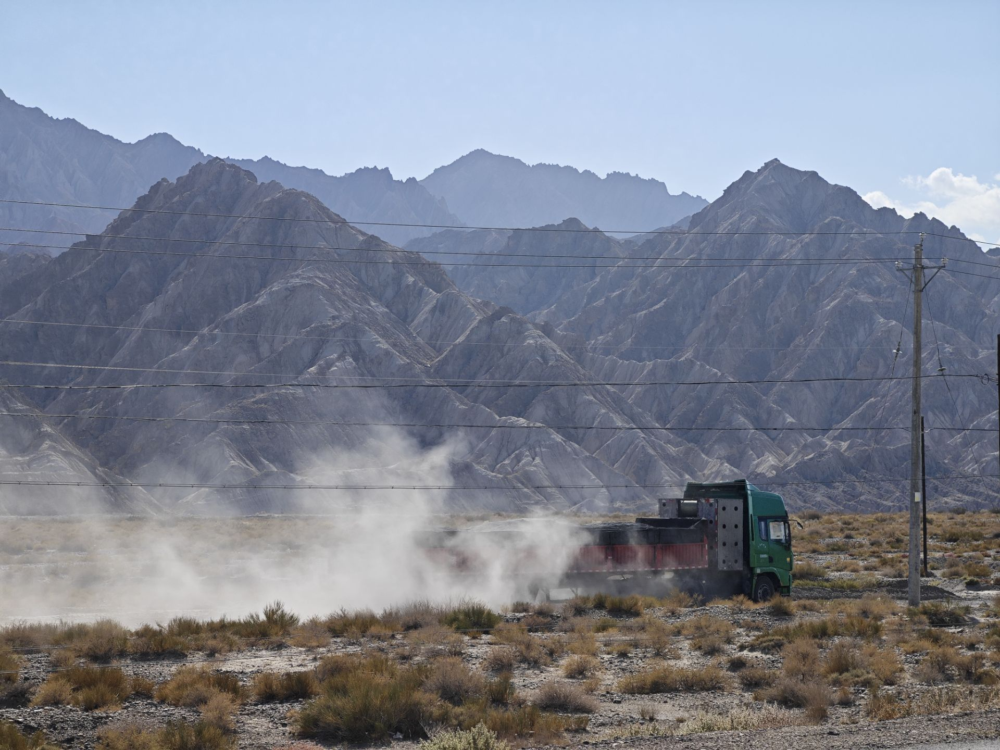

> 图：路上大车卷起的滚滚烟尘

### Day+1 库车 & Day+2 库车-北京

邮寄：我们先到 517 驿站问了邮寄公路车（200 一辆），说是物流小哥帮忙打包（之前网上有人说打包和物流都有问题，收到的车都坏了）；于是我们第二天电话找了美利达邮寄（240 一辆，460 两辆，禧玛诺认证技师打包，京东物流配送），顺便参观了店里，东西都很齐全，老板也是个爱骑行的技术宅；收到自行车后，看到打包的很仔细，车子很完好（不足是每个箱子破了一两个大洞，不知道是大包就用的破箱子还是物流弄破了）。

住宿：搬到城里住了一晚金色阳光酒店的总店（五一南路）226 一晚，贵一点但周围热闹一些，含早晚自助餐、免费接送机，房间面积更大；自助餐人少一些，但菜品种类和前一家差不多，味道也还行。

返程（10/06）：KN5618（18:40 库车龟兹 -> 经停鄂尔多斯 -> 00:30 北京大兴）。

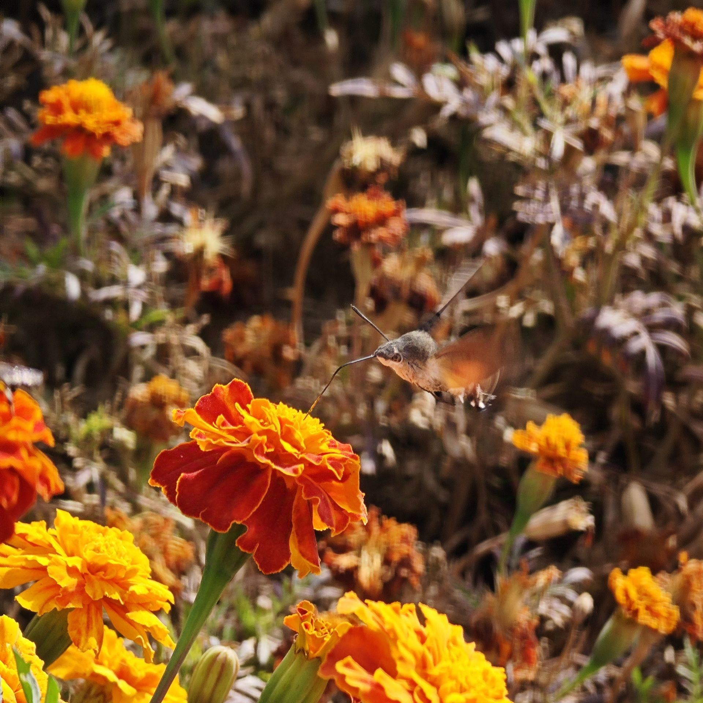

> 图：正在采花蜜的蜂鸟鹰蛾（似鸟、似蝶、似蜂、是蛾）

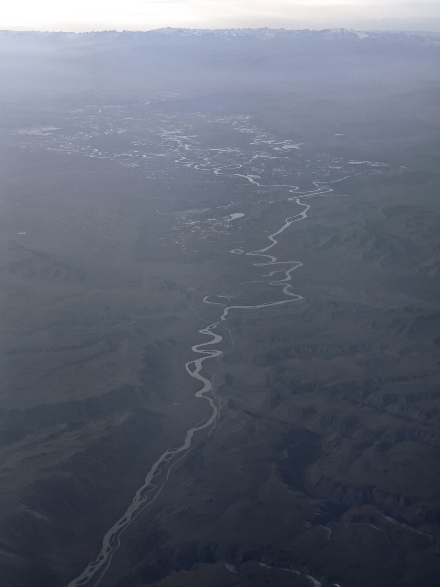

> 图：航拍巴音布鲁克草原上开都河的九曲十八弯

## 总结

尽管独库公路的骑行体验（路况、补给）不如 318 川藏线，但一路上的风景和暖心的人们总能给我们带来不一样的惊喜。
