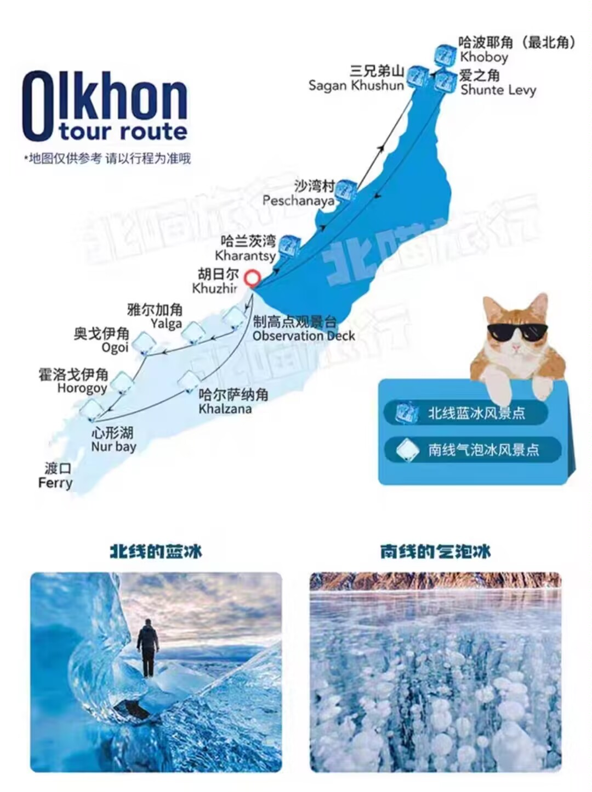

# 俄罗斯假日

> 2025/1/26-2/3
> 
> 极寒的西伯利亚 & 冰封的贝加尔湖。

## 行程

> 1RMB（人民币） = 13.5~13.7RUB（卢布）

| Time | Event |
|------|-------|
| 1/26 6:03-8:35 | Daxing -> Irkutsk (Flight: S76312) |
| 1/26 | Irkutsk -> Khuzhir (Stay: Baikal Terra Hotel) |
| 1/27 | Khuzhir & Olkhon Island North (Stay: Baikal Terra Hotel) |
| 1/28 | Khuzhir & Olkhon Island South (Stay: Baikal Terra Hotel) |
| 1/29 | Khuzhir -> Irkutsk (Stay: Aristokrat Hotel) |
| 1/30 | Irkutsk -> Listvyanka (Stay: Dauria Hotel) |
| 1/31 | Listvyanka -> Irkutsk (Stay: Aristokrat Hotel) |
| 2/1 | Irkutsk (Stay: Aristokrat Hotel) |
| 2/2 | Irkutsk |
| 2/3 1:24-3:42 | Irkutsk -> Daxing (Flight: S76311) |

- 签证 377 * 2 = 754 RMB
- MTS 电话卡 76.5 * 2 = 153 RMB
- 往返机票（电话比官网便宜）2398 * 2 = 4796 RMB
- Baikal Terra Hotel 三晚 177 USD
- Aristokrat Hotel 一晚 36 USD + 两晚 81 USD
- Dauria Hotel 一晚 48 USD
- 上下岛、南北线 992 * 2 = 1984 RMB
- 现金花费 59000 RUB

## 26 Beijing - Irkutsk - Khuzhir

- 凌晨 2 点从家里坐车出发，到大兴机场；由于飞机晚点，站着排队半小时才登机（主要担心上去晚了没地方放登山包）；飞机上很热，大家都抱着羽绒服
- 早上 8 点半抵达伊尔库茨克，落地后滑行 20 分钟，再乘坐 10 分钟摆渡车就到了海关；整个机场很小，海关通道不多，而且同航班很多旅游团，所以我们下车后冲去排队，避免了后续长时间的等待；排队过程中忐忑的换上提前买的电话卡，幸运的发现可以正常使用（今年初要求实名制，很多淘宝卖的旧卡都激活不了）；前面 7-8 人，一人大约 3-5 分钟，不到半小时就过了海关（最后安检的时候，我们把登山包放到 x 光机上，俄罗斯大妈和我们说了一大通话，没听懂）
- 早上 9 点半在机场大厅等候，顺便把飞机上发的三明治吃了；机场很小但暖气很足，坐着也能一直出汗；到了 10 点，坐上了小巴，但同行人没到齐，后边等到了 10 点半才出发
- 中午 12 点半到达半路上的服务区，我们吃了些从北京带的面包；下车后很明智的从背包里拿出衣服和裤子，及时穿上；停留半小时后，继续行驶
- 下午 2 点半，到达气垫船码头，一人花了 500 RUB，随机上了一艘船；气垫船在冰上滑行 15 分钟后到达对岸（据说也可以走过去），然后大家就在这里等待最后一轮换乘（还好提前换了徒步裤、加了保暖裤，不然这一段风大、很冷）
- 下午 3 点 20 终于凑齐了人（很多人行李箱太大，搬运起来很耗时），从南岸往北开到胡日尔村
- 下午 4 点达到我们的酒店，办入住的是一位蒙古裔老奶奶，屋里还养了一只胖猫；老奶奶不会英文，沟通主要靠翻译器，然后会用谐音词来念你的名字（导致念了好久不知道她在叫我）；她会问你有没有预定南北线，如果没有估计可以找她预定（但同行人都是报了淘宝上的团，所以没人找她预定）
- 下午 4 点半入住，感觉房间不太暖，脱了羽绒服会感到寒冷；因为一天的辗转让人疲惫，我们在屋里休息了一会，顺便研究羊毛袜和后续要穿的装备
- 傍晚 5 点出门看日落，不过往萨满岩走需要十几分钟，加上当天多云，没看到日落；恰好今天遇到大降温，零下 30 度，呼出的水蒸气很快会结冰；在萨满岩附近好多流浪狗，在找人乞食（后边发现整个村子里很多，而且分成多个派系）；因为太冷了，加上很快天色就暗了（6 点前），我们没有停留太久就前往超市
- 晚上 6 点到了村里第二大的超市，逛了十几分钟，再到隔壁的网红餐厅时，发现挤满了人，我们排了几分钟，决定去找其他餐厅；先去的第一家餐厅没开门，于是一直原路返回，找另一家餐厅
- 晚上 6 点 40 到了一家评分也比较高的餐厅；我们尝试把菜单拍照发给豆包翻译，结果翻译的结果很有问题，导致点菜全是错的（点餐的小哥会英文，一脸懵逼，我们指着 A 说是 B，点了菜单上没有的牛排）；因为人很多（后边吸取教训，一定要错峰吃饭），点完菜已经接近 7 点，上菜时已是 7 点半（他们会严格按照订单顺序制作、制作完所有菜然后一次性上齐）；我们点了 5 道分量很小的菜，总共花了 1220 RUB，但感觉没吃饱，而且一天几乎没吃什么肉
- 晚上 8 点吃完饭之后，先去刚刚的超市买了一个大红肠，再到村里最大的超市逛了一圈，最后溜达回酒店；到了酒店，我们就这牛奶，干吃了一整根红肠（第一次吃，发现肠衣嚼不烂，后边查了发现是塑料，还好没吃进去），导致第二天早上的尿里都是无机盐味（以后不敢这么吃了，估计会伤身体）；今天太累，回去歇了一会，洗澡后，晚上 10 点左右就睡了

## 27 Khuzhir

- 早上 8 点半才天亮，晚上的确很冷，睡下来感觉是勉强没被冷醒
- 早上 9 点开始供应早餐，流程是先找地方坐下，然后会给一份基础早餐（粥、煎饼、鸡蛋、芝士片、火腿片、黄瓜片），其余东西自助（牛奶、咖啡、面包片、酸面包片、水果沙拉、饼干、糖，面包片可以自己烤）；由于我们担心维生素 C 不够，前三个早上都喝泡腾片
- 早上 10 点我们在门口等车来接，结果等了十分钟才来；同行的是 6 个住在隔壁 Khan 酒店的小姐姐；今天总共逛了 5 个景点，中途 1 次停车上厕所；看到了蓝冰和冰挂，在最北端远眺了贝加尔湖对岸；吃午饭的位置在最北端，因为我们下午 2 点才到，等到了 3 点 10 分才吃上鱼汤（说是 3 点，但在等前面桌的人吃完）；饭前只有我们俩和一个小姐姐走到了最北端，其他人很早就回到车上休息了（玩不动）；因为我在给其他人拍照，为了追回路程，小跑有些着急，袜子出汗有些湿了，后边感觉脚冷；我们几乎是最后吃完的，旁边有一群渡鸦在等人都走了吃剩饭；午饭后的最后一个景点叫做爱情石，车上其他小姐姐们都累了，全都没下车；我们在这里遇到了一对会说英文的情侣，之前在北端就遇到了，相互帮忙拍照后（我感觉给他们拍的很好，但她给我们拍的都是歪的），和我们说去了石头左边拜可以生男孩、去右边生女孩（但我们只去了左边）
- 晚上 5 点半回到酒店附近，我尝试追逐落日，但失败了，回到房间歇了一会再去吃饭
- 晚上 6 点打算尝试走另一条近路去昨天没吃上的餐厅，结果遇到一条凶狗拦路不让过，于是换了条路（还好距离差不多）；到昨天的网红餐厅时已是 6 点 10 分，还是人很多、没有位置，于是去了一家酒店附近的餐厅（当时不用排队，但我们刚点完菜就坐满了，后边的人开始排队）；这回改用 Yandex Translate 翻译菜单，终于点到了我们想吃的东西（除了一些专有名词翻译不出，但大部分都能大概看懂；排队时看到一个小姐姐推荐了一款付费 app 专门翻译菜单，说是还能看到实物）
- 晚上 7 点半又去了两家之前的超市（饭前已经去过一家买了酸奶），出门遇到一只奶牛狗盯着我们手里的冰激凌，于是我们留了个底送给它，它很开心
- 晚上 8 点回酒店，今天没那么累，洗完澡后，刷刷手机、删删废片，大概 11 点也睡了

## 28 Khuzhir

- 早上 8 点多一些睡不着，起来收拾，屋里还是一样冷
- 早上 9 点多一些去吃早餐，今天的早餐有黄色苹果切块；由于昨天发现迪卡侬的大棉服被钩破了，早上想去前台借剪刀把钩出来的纤维剪断，但到了餐厅，我试着问问 scissors 并比划了一下剪刀的意思，于是那个备餐的小哥复述了一句 scissors?，我点点头，他很快就借给了我剪刀
- 早上 10 点左右，车子很快就到了酒店门口，今天一起拼车的是一个在俄罗斯工作的大哥+一对在叶卡捷琳堡留学俄语专业的情侣+一对中国情侣+一家三口；今天的南线一开始在湖岸边看了两个景点的冰挂和蓝冰，风景和昨天北线的差不多；随着一路往南走，风越来越大、积雪越来越少；一路走到南边的心形湖附近，同行人大部分都去贝加尔湖上滑冰，只有我们和一个大哥徒步去山顶拍照，到了山顶可以远眺对岸的雪山；徒步一小时回来后，司机煮好了鱼汤，但分量不如昨天大，于是吃了很多小甜饼和面包片充饥；饭后先去了一个山顶的景点，然后下到最南端的湖面上看气泡冰，不过气泡冰不太多，如果想看清楚则要先扫开冰面的雪然后泼水清洁，由于当时气温太低、正在下雪，导致刚泼水的冰面很快就模糊、拍不清楚了；冰面上还有人挖的小洞，同行的一家三口的爸爸把酒倒进去，但发现没有吸管，只抿了一小口
- 下午 3 点半就回到房间了，简单的休息了一会
- 下午 4 点先去一家北边的 Art Gallery 买纪念品，屋里只有一个小姐姐会说英文（而且还有幽默感，比如说 sure you can touch, but don't bite），另一个小姐姐只能通过翻译器沟通；整个店里商品齐全，大部分都是手工制品，有一些是他们自己做的，一些是从其他地方购买的；我们买了很多石头小海豹冰箱贴，小的一个 200 RUB，大一些的一个 500 RUB，她很喜欢所以买了不少，还买了一些送人的东西；4 点半刚到的时候店里人不多，但我们 5 点左右走的时候，来了很多俄罗斯人（这家店估计也挺出名的）
- 傍晚 5 点从商店出来，去昨天的山上追落日，这次终于追到了落日；不过路上遇到一对情侣也去追落日，于是我先去山顶上，她和他们一起走，结果他们去了萨满岩的方向，最后她绕了一圈才找到我
- 晚上 5 点半去了前两天人很多导致没吃上的餐厅，俩人吃了 6 个菜总共 1630 RUB，不过到了 6 点半我们吃完的适合，才看到需要排队，所以感觉没有前两天人多；由于晚餐的烤鸡有骨头，于是我们把吃剩的骨头拿去喂狗，结果引发了一场争夺战，先是一只狗吃了大部分，然后另一只见到后冲过来抢走了碗（碗里只有少部分），最后又来了一只冲过来和第一只一起去抢这个碗，导致第二只狗不得不扔下这个碗（感觉没吃上）
- 晚上 6 点半饭后又去了两家超市，在最大的超市里边的纪念品区，又买了一个手工石头小海豹群摆件（一个大石头上粘着 7 个石头小海豹），也只卖 500 RUB，比下午的便宜
- 晚上 7 点半就回到了酒店，回了一些拜年的信息，刷刷手机，很早就休息了

## 29 Khuzhir - Irkutsk

- 早上 8 点多起床，本想睡个懒觉，但睡不着了，吃早餐的时间和昨天也差不多
- 早上 10 点半出门溜达，打算绕着村子转一圈，但最后只去了村子的东南角转了一圈，绕到超市逛完就回去了（冰天雪地徒步速度的确比正常走路慢了不少），最后从山顶上回去时她走的太急鞋里又进雪了；路上遇到一群渡鸦聚餐，走近一看是人类的残羹剩饭，我们走近了之后他们很谨慎的飞走了，等我们远离后才慢慢靠近回去
- 中午 12 点赶回到酒店退房，我先交了钥匙给奶奶，再回去收拾东西，结果不到 10 分钟餐厅的小哥就来查房了；于是我们去大堂休息，等了半个多小时车才到
- 下午 1 点终于上车了，
- 坐在小姐姐旁边、气垫船渡口附近只有一家咖啡厅有厕所但不买东西收费100一人，如果买了一个50的面包就可以免费上厕所、酒店很热+临街很吵+订的大床但给的双床、晚上吃酒店隔壁的贝加尔湖特色菜+墙上还有一张熊皮

## 30 Irkutsk - Listvyanka

去程 620 俩人、狗拉雪橇 7000 两人每人2km、冰雪大滑梯 700 一小时、博物馆 1200 俩人、从雪橇基地打车到大滑梯 470、从大滑梯打不到车只能让酒店帮忙叫车到博物馆 500、晚上吃烤肉 3120

## 31 Listvyanka - Irkutsk

路边烤鱼 350 一条（刚到时来了一车中国游客，我们没在市场买）、午餐 2190、雪地摩托 6000 一小时（原价6500但我们没有零钱+中途车坏了10分钟，最后给7000只收6000）、返程 620 俩人（不过可以门口坐私拉客人的车）、晚上超市随便买点吃的、楼下遇到泰国59岁华裔大哥+自由行小姐姐（一个人旅行，泰国大哥提醒她要注意陌生人）、门口偶遇俩刚桑拿完的浙江人于是商量拼桌和券+进门蒙古大哥握手+工作了7年的女同+工作了5年的29岁高个小姐姐+俯卧撑&摔跤+隔壁桌看完一人就主动要交朋友、晚上睡觉没感觉冷但很吵

## 01 Irkutsk

上午吃早餐遇到小姐姐今天包车去岛上，但预算是1000一天、吃完饭citywalk、路过歌剧院订了两张晚上6点的票（刚开始大妈推荐800一张的内圈票，但看到官网是还有600一张的阳台票，于是省了200）、中午在商场吃了麦当劳、后边累了就回去休息了、下午取钱发现附近的ATM没有钱，只能走到北边的银行取钱、第一次不小心去了1000（74.29)结果浪费了10RMB的手续费，后续算了很久剩下行程的预算又取了2次10000（742.87，因为每次最多取10000），但回来之后发现算错时间了、教堂有人唱诗、晚上歌剧很多打扮精致的好看小姐姐，结束遇到在鞍山留学的小姐姐，能用简单的中文交流，于是吐槽今晚听不懂，她也吐槽京剧听不懂、晚上酒店房间仍是冷+吵

## 02 Irkutsk

早上和前一天群里约的夫妻拼k9坦克，在一个流浪狗收容所里，不到一小时就结束了、中午先去喀山教堂再去路上一家历史博物馆、吃了特色菜只花了1020（卡尔马克思大街且装潢很好）、下午继续city walk、看教堂有人唱诗但规模不如昨天、给了剩下零钱给住在北边的小姐姐、晚上去商场买购物+买麦当劳奶昔+吃之前剩下的蛋糕和饼干和苹果、晚上10点以后打车涨价从300卢布到600卢布

## 03 Irkutsk - Beijing

一路上太困了一直睡觉、提前一小时到大兴于是拼车回家

## 总结

（WIP）
