# 网页渲染导致浏览器卡顿的小故事

> 2025/3/16 -> 2025/3/19
> 
> 揪出藏在 “沙丁鱼群里的鲶鱼”。

[TOC]

## 背景：从页面内蔓延出的卡顿

最近在浏览一个经常访问的网站，发现滚动到某个区域时，画面会突然变得很卡。然而，与常见的页面性能问题不同：

- 不仅是当前页面卡，整个浏览器的任何操作都异常卡顿 —— 像是这个卡顿的问题从页面内蔓延到了整个浏览器上；
- 然而，此时系统上的其他软件都很流畅，显然这个问题不是系统资源不足导致的 —— 像是页面的这个区域触发了浏览器的某个缺陷。

> 点击展开以下区域，可以看到卡顿。（注：性能越差、屏幕分辨率越高的设备上越明显）
> 
> 1. 如果看不到彩色背景图或中间动图，请刷新页面；
> 2. 如果看到了彩色背景图和中间动图、但不卡顿，请放大这个区域（越大越卡）。

<p><details>
<summary> 👉 点我预览：卡顿的效果 👈 </summary>
<div style="
       width: 100%;
       aspect-ratio: 4/3;
       background: url('2025/Webview-Layer-Optimization/complicated.svg') center/cover no-repeat;">
  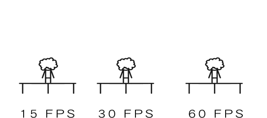
</div>
</details></p>

## 分析

> 本文基于 Chrome 134.0.6998.89 分析，其他版本可能与本文提到的细节不一致。

### 由表及里：初见鲶鱼

从现象上看，在我的 Windows PC 上，整个浏览器似乎在以 6.6fps 或者更低的帧率在显示。

[img=width:30%]

[align-center]

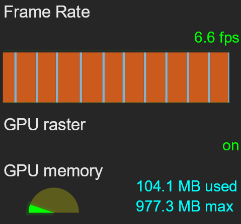

如果此时打开 Windows 任务管理器，可以看到系统中最活跃的是浏览器的 GPU 进程 —— 不仅占用了系统 6% 的 CPU 资源，还会消耗 30% 的 GPU 3D 计算资源（注：一般 GPU 的 3D 引擎主要负责图形渲染）。


如果使用 DevTools 的 Performance 抓取当前页面的性能数据，无法直接找到原因：

- Renderer 进程的主线程非常空闲，没有执行可疑动作，也没有重新布局；
- 反倒是最下边的 GPU 和最上边的 Frames 看起来不太正常，但无法直接指出问题所在。

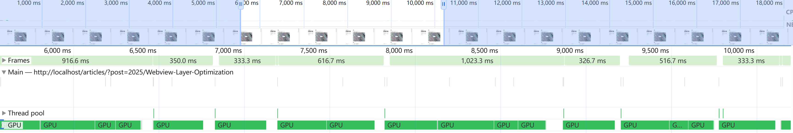

如果使用 `chrome://tracing` 抓取一段，可以看到 Renderer 进程无异常，而 GPU 进程存在异常：

|   | Windows <br/> 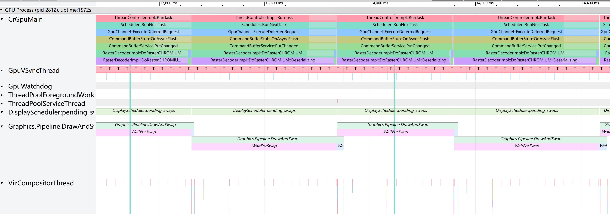 | macOS <br/> 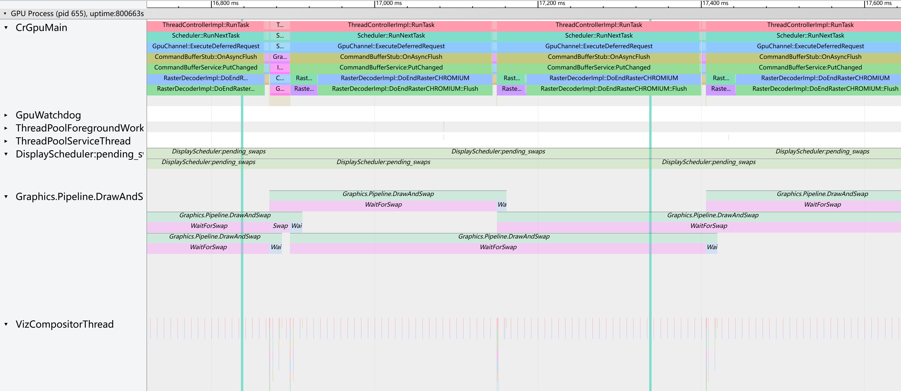 |
|---|---------|-------|
| **垂直同步** _(VSync)_ | `GpuVSyncThread` 线程每 16.66~16.67ms 按时触发一次（60fps） | `VizCompositorThread` 线程每 ~8.33ms 按时触发一次（120fps） |
| **光栅化** _(rasterize)_ | `CrGpuMain` 主线程消费一次 Command Buffer 耗时 220~270ms 导致阻塞 | `CrGpuMain` 主线程消费一次 Command Buffer 耗时 240~250ms 导致阻塞 |
| **合成** _(composite)_ <td colspan=2> `VizCompositorThread` 线程负载较低，能按时合成结果，不是瓶颈 |

注 1：虽然在 Renderer 和 GPU 进程中都有 rasterize 和 composite 的概念，但在 **Renderer 进程**里的这两个概念都是**由 CPU 抽象出来**的、**系统/硬件无关**的，而在 **GPU 进程**里的这两个概念才是**由 GPU 真正执行**的、**系统/硬件相关**的。

注 2：基于目前的 [viz 进程架构](https://developer.chrome.google.cn/docs/chromium/renderingng-architecture#cpu_processes)（理念参考 [Chrome Service Model](https://docs.google.com/document/d/15I7sQyQo6zsqXVNAlVd520tdGaS8FCicZHrN0yRu-oU#heading=h.iprlpydhaivf) 设计的面向服务架构 _(Service-Oriented Architecture, SOA)_），即使禁用了 GPU 硬件加速，仍能看到 GPU 进程（实际上应该叫做 Viz 进程）在执行底层的渲染动作。

> 补充：在同一台 Windows PC 上测试，软渲染可以达到 45fps（由此可见，软渲染的效果不一定比硬件加速渲染差），但整体 CPU 使用率很高：
> 
> [img=width:30%]
> 
> [align-center]
> 
> 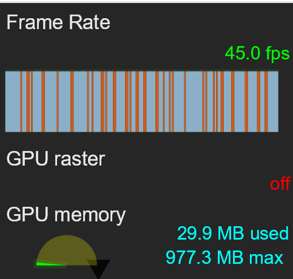
> 
> 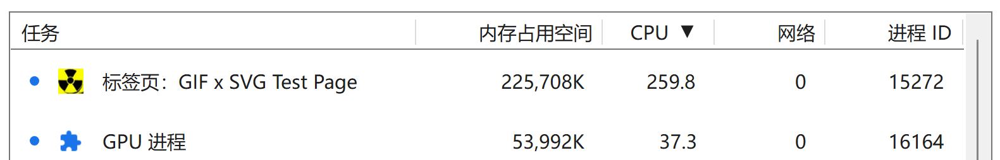
> 
> - GPU 进程的 `VizCompositorThread` 线程负载较高（但没有跑满单核），
> - Renderer 进程的线程池负载极高、被光栅化任务填满（已跑满多个核）。
> 
> 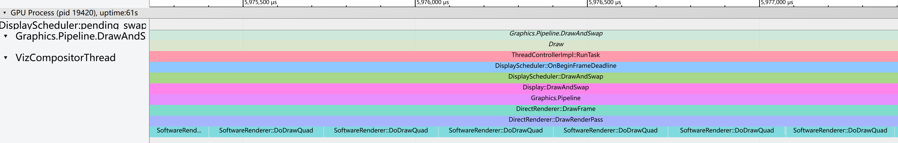
> 
> 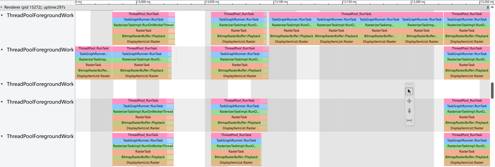
> 
> 对于浏览器的渲染流程，可以参考[柯幽](https://keyou.github.io/blog/)画的这张图（关于更多细节，可以阅读文末提到的相关资料）：
> 
> [](https://keyou.github.io/data/blink-1000.svg)

虽然 `chrome://tracing` 可以从浏览器底层实现的视角分析问题，但难以关联到上层的业务代码上。

所以，只能结合已知信息和以往经验，初步推测：存在一段代码（一定不是 JS 动画或 CSS 引发的重新布局），会导致页面中 GPU 渲染性能较差的部分被反复重绘。

> 💡 像是一条活跃的鲶鱼搅动了庞大的沙丁鱼群，导致沙丁鱼群出现了严重的骚动。

### 工具分析：换上渔网

> 💡 如何从庞大的沙丁鱼群中快速找到那条鲶鱼呢？—— 换上合适的渔网。

如今强大的 Chromium DevTools 提供了渲染问题的分析工具，能高亮出需要重绘的区域。参考：

- [Discover issues with rendering performance - Highlight repainted areas with paint flashing](https://developer.chrome.com/docs/devtools/rendering/performance#paint-flashing)、[发现渲染性能的问题 - 使用绘制闪烁突出显示重新绘制的区域](https://developer.chrome.google.cn/docs/devtools/rendering/performance#paint-flashing)
- [Simplify paint complexity and reduce paint areas - Use Chrome DevTools to quickly identify paint bottlenecks](https://web.dev/articles/simplify-paint-complexity-and-reduce-paint-areas#use_chrome_devtools_to_quickly_identify_paint_bottlenecks)、[降低绘制的复杂性并减少绘制区域 - 使用 Chrome DevTools 快速找出绘制瓶颈](https://web.developers.google.cn/articles/simplify-paint-complexity-and-reduce-paint-areas#use_chrome_devtools_to_quickly_identify_paint_bottlenecks)）

针对之前的页面，可以看到它的重绘区域便是中间的动图（且该动图的帧率极高）：

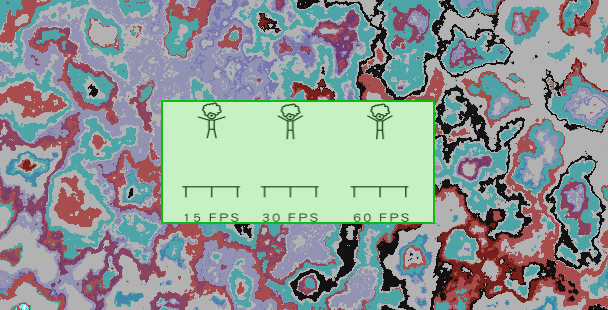

而在动图的背后，是一张非常复杂的 SVG 矢量图（由于包含了许多复杂的运算，甚至在首次打开这张图片时，一般的浏览器都会卡顿一下）。

> 💡 中间的高帧率动图就是那条“鲶鱼”，而复杂的 SVG 背景图就好似“庞大的沙丁鱼群”。

### 试验检验：揪出鲶鱼

> 💡 拿掉鲶鱼试试？—— 恢复平静。

在之前的页面上，如果删除中间的高帧率动图（或者替换成一张静态图），就不再卡顿。

<p><details>
<summary> 👉 点我预览：只有静态图的效果 👈 </summary>
<div style="
       width: 100%;
       aspect-ratio: 4/3;
       background: url('2025/Webview-Layer-Optimization/complicated.svg') center/cover no-repeat;">
</div>
</details></p>

> 💡 减小沙丁鱼群的规模试试？—— 恢复平静。

在之前的页面上，如果删除复杂的 SVG 背景图（或者替换成一张简单背景图），也不再卡顿。

<p><details>
<summary> 👉 点我预览：只有动图的效果 👈 </summary>
<div style="
       width: 100%;
       aspect-ratio: 4/3;
       background: grey;">
  
</div>
</details></p>

至此，我们确认了问题的原因：

- 每次渲染中间的高帧率动图时，都会引起复杂的 SVG 背景图被反复重绘；
- 性能问题的严重程度 = 渲染的频繁程度 × 单次渲染的复杂度。

## 优化：装入罐中

> 💡 如果既要保留鲶鱼、又不能减少沙丁鱼，要怎么办呢？—— 把鲶鱼放进一个单独的罐子里，和沙丁鱼群隔开即可。

通过设置动图的 CSS 属性 [will-change](https://developer.mozilla.org/en-US/docs/Web/CSS/will-change) 即可实现其与背景元素的 **图层** _(layer)_ 分离。

<p><details>
<summary> 👉 点我预览：优化后的效果 👈 </summary>
<div style="
       width: 100%;
       aspect-ratio: 4/3;
       background: url('2025/Webview-Layer-Optimization/complicated.svg') center/cover no-repeat;">
  
</div>
</details></p>

优化后，在同一台 Windows PC 上，可以非常流畅的显示 60fps 动画。

[img=width:30%]

[align-center]

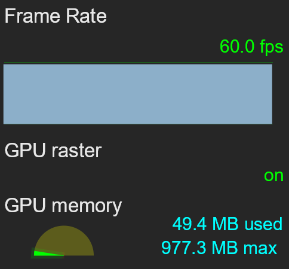

> 补充：如果使用软渲染，效果和优化前类似，也只能达到 45fps，但整体 CPU 使用率很低（由此可见，图层优化也适用于软渲染的场景）：
> 
> [img=width:30%]
> 
> [align-center]
> 
> 
> 
> 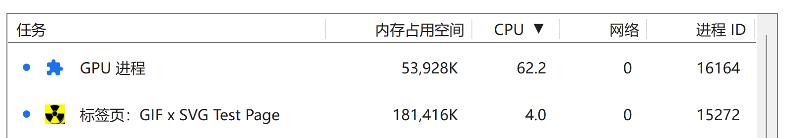
> 
> - GPU 进程的 `VizCompositorThread` 线程负载升高（但也没有跑满单核），
> - Renderer 进程的线程池非常空闲、偶尔只有几个光栅化任务（已跑不满单核）。

强大的 Chromium DevTools 还提供了图层的分析工具，能让我们“换个视角看页面”。（参考：[Layers panel: Explore the layers of your website](https://developer.chrome.com/docs/devtools/layers)、[“层”面板：浏览您网站的各个层](https://developer.chrome.google.cn/docs/devtools/layers)）

针对优化后的页面，可以看到中间的动图被放入了一个独立的图层中：

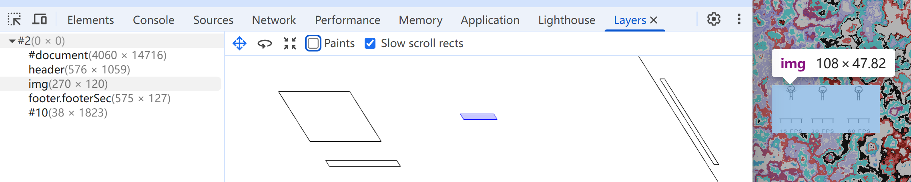

> 💡 可以提前把每条鱼都装进一个单独的罐子里吗？当然不可以。

避免过度使用图层 —— 如果过度使用了图层（例如使用以下代码将所有元素提升到一个单独的图层上），反而会导致性能劣化（例如页面卡顿、内存占用更大）。（参考：[Stick to Compositor-Only Properties and Manage Layer Count - Manage layers and avoid layer explosions](https://web.dev/articles/stick-to-compositor-only-properties-and-manage-layer-count#manage_layers_and_avoid_layer_explosions)、[坚持使用仅限合成器的属性并管理图层数量 - 管理图层并避免图层爆炸](https://web.developers.google.cn/articles/stick-to-compositor-only-properties-and-manage-layer-count#manage_layers_and_avoid_layer_explosions)）

``` css
* {
  will-change: transform;
}
```

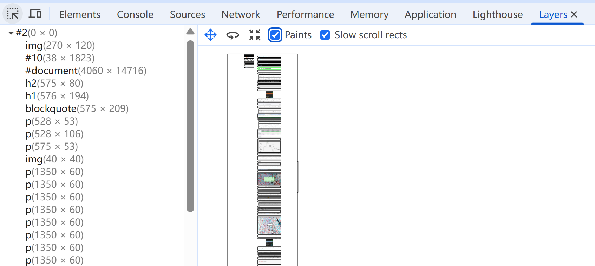


**性能优化没有银弹** —— 不要提前优化“还未发生的”性能问题，而要先分析再优化，避免“过度优化”带来的劣化。

## 写在最后

针对本文提到的问题，如果将视野局限于 Renderer 进程，通过 DevTools 的 Performance 分析，只能看到 **像素流水线** _(pixel pipeline)_ 的各环节上的性能问题。

[](https://web.developers.google.cn/articles/rendering-performance#the_pixel_pipeline)

> 例如很多文章常常建议：尽量使用 “合成器 CSS 动画”，而不是 “JS 动画” 或 “可能导致重新布局的 CSS 动画”；因为后两者都需要在 Renderer 进程的主线程上执行，其渲染效率受制于主线程的繁忙程度。（此类问题可以通过 DevTools 的 Performance 分析）
> 
> 顺便给大家推荐一些前端性能分析文章：
> 
> - [Animations and performance](https://web.dev/articles/animations-and-performance)、[动画和性能](https://web.developers.google.cn/articles/animations-and-performance)
> - [Rendering performance](https://web.dev/articles/rendering-performance)、[渲染性能](https://web.developers.google.cn/articles/rendering-performance)
> - [Measure performance with the RAIL model](https://web.dev/articles/rail)、[使用 RAIL 模型衡量性能](https://web.developers.google.cn/articles/rail)
> - [The Anatomy of a Frame](https://aerotwist.com/blog/the-anatomy-of-a-frame/)、[浏览器帧原理剖析](https://juejin.cn/post/6844903808762380296)

只有使用恰当的工具，结合浏览器的原理，逐步分析，才能看到问题的“真面目”。

最后，再给大家推荐一些不错的浏览器渲染原理的文章：

- 官方文章：
  - （新手友好、无需计算机基础）[Inside look at modern web browser (part 3)](https://developer.chrome.com/blog/inside-browser-part3#dividing_into_layers)、[深入了解现代网络浏览器（第 3 部分）](https://developer.chrome.google.cn/blog/inside-browser-part3#dividing_into_layers)（注：文末的“合成”流程已改为 viz 服务，不再经过主进程，具体可参考下面的 viz 相关文章）
  - （最新、最详细、图文并茂）[RenderingNG, next-generation rendering architecture](https://developer.chrome.com/docs/chromium/renderingng)、[RenderingNG，新一代渲染架构](https://developer.chrome.google.cn/docs/chromium/renderingng)
- 外网文章：
  - [Life of a Pixel](https://bit.ly/lifeofapixel)（注：国内很多译文的内容都已过期，请阅读[基于 Chrome 88.0.4307.0 (Nov 2020) 或更新版本的幻灯片](https://docs.google.com/presentation/d/1boPxbgNrTU0ddsc144rcXayGA_WF53k96imRH8Mp34Y)；[备份](Webview-Layer-Optimization/Life-of-a-Pixel.pdf)）
  - [How Blink Works](https://docs.google.com/document/d/1aitSOucL0VHZa9Z2vbRJSyAIsAz24kX8LFByQ5xQnUg)、[How Blink Works 中文译文](https://zhuanlan.zhihu.com/p/52918538)
  - [How cc Works](https://github.com/chromium/chromium/blob/main/docs/how_cc_works.md)、[How cc Works 中文译文](https://zhuanlan.zhihu.com/p/54601110)
- [UC 内核大佬 易旭昕](https://www.zhihu.com/people/rogeryi) 的文章：
  - [浏览器渲染流水线解析与网页动画性能优化](https://zhuanlan.zhihu.com/p/30534023)（注：目前 Display Compositor 已从主进程移到了 GPU 进程的 viz 服务里，具体可参考下面的 viz 相关文章）
  - [Chromium Viz 浅析 - 介绍篇](https://zhuanlan.zhihu.com/p/61416139)
  - [Chromium Viz 浅析 - 合成器架构篇](https://zhuanlan.zhihu.com/p/62076419)
- [柯幽](https://keyou.github.io/blog/) 的文章（偏细节，适合结合源码阅读）：
  - [How cc works](https://keyou.github.io/blog/2020/06/28/how-cc-works/)
  - [How viz works](https://keyou.github.io/blog/2020/07/29/how-viz-works/)
  - [How canvas works](https://keyou.github.io/blog/2022/12/01/canvas/)

如果有什么问题，**欢迎交流**。😄

Delivered under MIT License &copy; 2025, BOT Man
